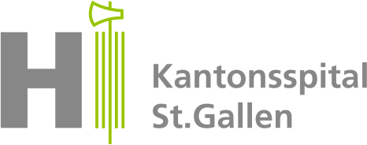

## What is KIDMO?

KIDMO (Kidney prediction model) is a clinical risk prediction tool designed to estimate the risk of graft loss in deceased-donor kidney transplantation. It provides individualized absolute risk estimates at 2 and 5 years using a small set of routinely available donor and recipient characteristics. Unlike many existing scores, KIDMO specifically predicts graft loss while appropriately accounting for death as a competing risk, making its predictions more clinically relevant at the time of organ offer.

## Why is KIDMO useful?

KIDMO supports clinical decision-making at the moment an organ is offered by providing transparent, personalized risk estimates of graft loss. This helps transplant teams and patients weigh the benefits and risks of accepting a specific kidney, enabling more informed and shared decisions. By focusing on absolute risk rather than relative scores, and by separating graft loss from mortality, KIDMO offers improved clinical utility compared to existing tools, potentially leading to better organ utilization and patient outcomes.

More details about the KIDMO study can be found in the published [study protocol](https://doi.org/10.1186/s41512-022-00139-5).

## Who created KIDMO?

KIDMO was developed by Swisstransplant and the [Swiss Transplant Cohort Study (STCS)](https://www.stcs.ch/), with an interdisciplinary team of statisticians, researchers, patient representatives, and clinicians from all six Swiss kidney transplant centers.

## Risk calculator

```{=html}
<iframe id="KIDMO" src="https://019e22cf-3c6e-7204-8289-a871d8bc5db7.share.connect.posit.cloud/" style="border: none; width: 100%; height: 570px" frameborder="0"></iframe>
```

## Interpretation

* The **KIDMO risk score** is a hazard ratio and shows the relative increase or decrease in the hazard rate of kidney graft loss for this recipient compared to the median hazard rate in the reference population from 2008 to 2021. So, a score > 1 indicates a higher graft loss rate, and an score < 1 indicates lower rate and a more favorable outcome, as we observed on average. A recipient with a score of 1.0 corresponds to the median hazard rate in the Swiss reference population of kidney transplant recipients.

* The **Rank** is the percentile of the recipients' risk score in the reference population and is interpreted as the percentage of recipients with a lower or equal graft loss rate compared to the new recipient. The rank has a range from 0% to 100%, and the lower the score, the more favorable the outcome.

* The **2-year risk and 5-year risk** are the cumulative incidences, i.e., the probability of graft loss at 2 and 5 years after transplant, respectively.

::: {.callout-tip title="Example" collapse=false}
* An **KIDMO risk score** of 0.51 means the recipient may have a graft loss rate that is 0.51 times that of the median graft loss rate. In other words, the graft loss rate is reduced by 49%.

* A recipient's **Rank** of 10% indicates that 10% of recipients had an equal or lower graft loss rate in the Swiss population, while 90% had a higher rate.

* A **2-year risk** of 0.02 and a **5-year risk** of 0.04 correspond to a 2% and 4% probability of graft loss within two and five years after transplantation, respectively. In other words, approximately 2 out of 100 recipients and 4 out of 100 recipients with similar clinical characteristics may experience kidney graft loss within the first two and five years, respectively.
:::

::: {.callout-note appearance="simple" collapse=false}
The **hazard rate** is the frequency at which kidney transplants fail over time. The **reference population** included all deceased-donor kidney recipients at Swiss transplant centers between 2008 and 2021. The **median risk** scenario is the median of all kidney transplants between 2008 and 2021 and is defined by a donor age of 65 and a transplant year of 2015, with all other variables set to their reference levels. By default, the risk calculator is initialized with the reference values, except for the transplant year, which is set to the current year.
:::

## References

Schwab S, Sidler D, Haidar F, et al. Clinical prediction model for prognosis in kidney transplant recipients (KIDMO): study protocol. *Diagn Progn Res.* 2023;7(1):6. [doi:10.1186/s41512-022-00139-5](https://doi.org/10.1186/s41512-022-00139-5)

## Terms of use

KIDMO is currently under development and intended for research purposes only. It has not yet undergone peer review, and the tool should not be used for clinical decision-making.

::: {.callout-important appearance="simple" collapse=true}
The KIDMO risk calculator (hereinafter referred to as "program") comes with ABSOLUTELY NO WARRANTY and LIMITATION OF LIABILITY. The program is currently under development and FOR RESEARCH PURPOSES ONLY; this program must not be used in clinical practice, including, but not limited to, clinical decision making. This program is provided WITHOUT ANY WARRANTY; without even the implied warranty of merchantability or fitness for a particular purpose. In no event, unless required by applicable law, will any copyright holder, or any other party who uses this program, be liable for damages, including any general, special, incidental, or consequential damages arising out of the use or inability to use this program.
:::

## Acknowledgments

KIDMO was developed by Swisstransplant in collaboration with all six Swiss transplant centers. Kidney transplant recipients were involved in the development of KIDMO.

{height=80 style="float:left; padding:16px"}
{height=80 style="float:left; padding:16px"}

{height=80 style="float:left; padding:16px"}
{height=80 style="float:left; padding:16px"}
{height=80 style="float:left; padding:16px"}

{height=64 style="float:left; padding:16px"}
{height=64 style="padding:16px"}