::: {.content-visible when-profile="de"}
Wieder deutlich mehr spendende verstorbene Personen und transplantierte Personen in der Schweiz.

:::

::: {.content-visible when-profile="fr"}
A nouveau une nette augmentation du nombre de donneurs décédés et de personnes transplantées en Suisse.

:::

::: {.content-visible when-profile="en"}

::: {.callout-warning title="Please note"}
**This page is still under development.**
:::

::: {.callout-warning title="Please note"}
To be translated..
:::

:::

::: {.content-visible when-profile="de"}
## 1. Warteliste

Hier finden Sie Kennzahlen zur Warteliste der Personen, die in der Schweiz auf ein Organ von spendenden verstorbenen Personen warten. Personen, die auf eine geplante Lebendspende warten, sind in diesem Abschnitt nicht mitberücksichtigt.

::: {.callout-tip title="Das Wichtigste in Kürze"}
Ende März 2026 warteten in der Schweiz 1233 Personen auf eines oder mehrere Organe von spendenden verstorbenen Personen. Im Vergleich zu Ende Dezember 2025 sind das 27 Personen weniger (-2 %). 9 Personen sind im ersten Quartal 2026 auf der Warteliste verstorben.
:::

### 1.1 Personen auf der Warteliste

{width=80%}

 

|Indikator                                   |Letztes Quartal  | Veränderung zum Vorquartal    |
|--------------------------------------------|----------------:|------------------------------:|
|Anzahl Personen auf der Warteliste          |1233             |-27 Personen (-2 %)            |
|Anteil inaktive                             |54 %             |+2 Prozentpunkte               |

::: {.callout-note title="Lesebeispiel"}
Ende letztes Quartal warteten in der Schweiz 1233 Personen auf eines oder mehrere Organe von spendenden verstorbenen Personen. Im Vergleich zum Vorquartal sind das 27 Personen weniger (-2 %). Mehr als die Hälfte (54 %) der Personen auf der Warteliste war zum diesem Zeitpunkt im inaktiven Status.
:::

### 1.2 Personen auf der Warteliste nach Organ

{width=80%}

 

|Indikator                                       |Letztes Quartal  |    Veränderung zum Vorquartal|
|------------------------------------------------|----------------:|-----------------------------:|
|Anzahl Personen auf der Warteliste (alle)       |1233             |-27 (-2 %)                    |           
|Multiorgan                                      |39               |+4 (+11 %)                    |
|Herz                                            |32               |-5 (-14 %)                    |
|Lunge                                           |37               |-5 (-12 %)                    |
|Leber                                           |283              |+3 (+1 %)                     |
|Niere                                           |828              |-22 (-3 %)                    |
|Pankreas/Inselzellen                            |14               |-2 (-13 %)                    |
|Dünndarm                                        |0                |+/- 0                         |

::: {.callout-note title="Lesebeispiel"}
Von den 1233 Personen auf der Warteliste wartete die grosse Mehrheit auf eine Niere (828; 67 %) oder eine Leber  (283; 23 %). 39 Personen warteten auf mehr als ein Organ.
:::

### 1.3 Ereignisse auf der Warteliste

{width=80%}

 

|Indikator                              |Letztes Quartal     |Veränderung zum Vorquartal                     |
|---------------------------------------|-------------------:|----------------------------------------------:|
|Anzahl transplantierte Personen        |150                 |+15 (+11 %)                                    |
|Anzahl verstorbene Personen            |9                   |- 4 (-31 %)                                        |

::: {.callout-note title="Lesebeispiel"}
Im letzten Quartal erhielten in der Schweiz 150 Personen eines oder mehrere Organe aus einer Organspende nach dem Tod. Dies sind 15 Personen mehr als im Vorquartal (+11 %). 9 Personen sind auf der Warteliste verstorben, 4 weniger als im Vorquartal.
:::

:::

::: {.content-visible when-profile="fr"}
## 1. Liste d'attente

Vous trouverez ici les chiffres clés sur la liste d'attente des personnes en attente d'un organe en Suisse. Les personnes listées pour un don de donneur vivant ne sont pas prises en compte dans cette section.

::: {.callout-tip title="L'essentiel en bref"}
Fin mars 2026, 1233 personnes attendaient en Suisse un ou plusieurs organes de donneurs décédés. Par rapport à la fin de décembre 2025, cela représente 27 personnes de moins (-2 %). Au premier trimestre 2026, 9 personnes sont décédées sur la liste d'attente.
:::

### 1.1 Personnes en liste d'attente

{width=80%}

 

|Indicateur                                  |Dernier trimestre |Changement par rapport au trimestre précédent      |
|--------------------------------------------|----------------:|---------------------------------------------------:|
|Nombre de patients en liste d'attente       |1233             |-27  patients (-2 %)                                |
|Part dans état inactif                      |54 %             |+2 points de pourcentage                             |

::: {.callout-note title="Exemple de lecture"}
A la fin du dernier trimestre, 1233 personnes attendaient en Suisse un ou plusieurs organes de donneurs décédés. Par rapport au trimestre précédent, cela représente 27 personnes de moins (-2 %). Plus de la moitié (54 %) des personnes sur la liste d'attente était classé en inactif.
:::

### 1.2 Personnes en liste d'attente par organe

{width=80%}

 

|Indicateur                                  |Dernier trimestre      |Changement par rapport au trimestre précédent |
|--------------------------------------------|---------------------:|---------------------------------------------:|
|Nombre de patients en liste d'attente       |1233                  |-27 (-2 %)                                 |
|Multi-organes                               |39                    |+4 (+11 %)                          |
|Cœur                                        |32                    |-5 (-14 %)                           |
|Poumons                                     |37                    |-5 (-12 %)                         |
|Foie                                        |283                   |+3 (+1 %)                           |
|Rein                                        |828                   |-22 (-3 %)                           |
|Pancréas/cellules des îlots                 |14                    |-2 (-13 %)                           |
|Intestin grêle                              |0                     |+/- 0                               |

::: {.callout-note title="Exemple de lecture"}
Sur les 1233 patients en liste d'attente, la grande majorité attendait un rein (828; 67 %) ou un foie (283; 23 %). 39 patients attendaient plus d'un organe.
:::

### 1.3 Événements sur la liste d'attente

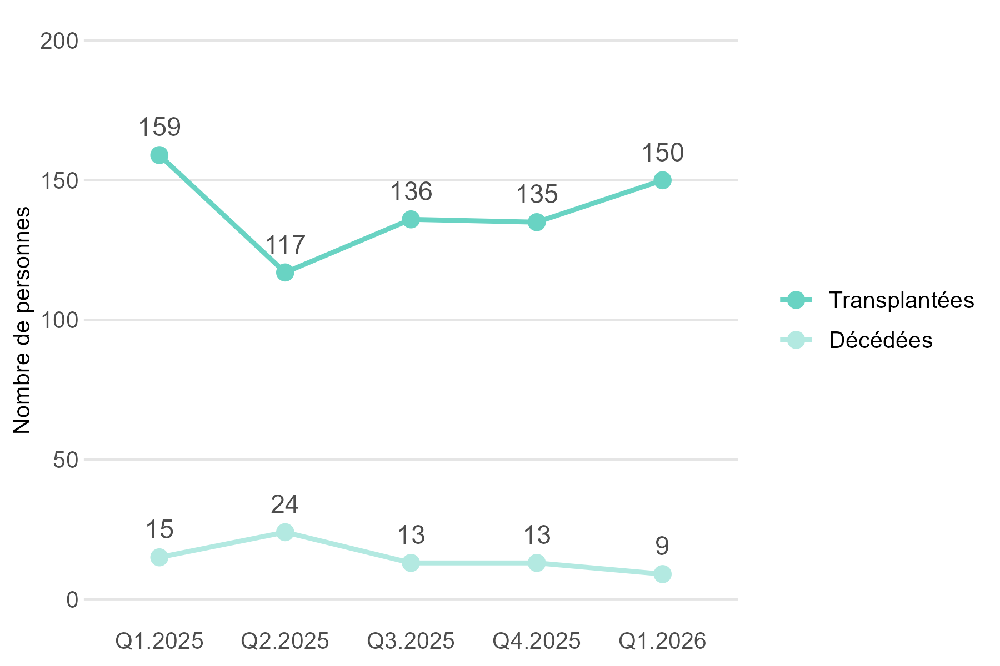{width=80%}

|Indicateur                          |Dernier trimestre              |Changement par rapport au trimestre précédent  |
|------------------------------------|------------------------------:|----------------------------------------------:|
|Nombre de patients transplantés     |150                            |+15 (+11 %)                                    |
|Nombre de patients décédés          |9                              |- 4 (-31 %)                                    |

 

::: {.callout-note title="Exemple de lecture"}
Au cours du dernier trimestre, 150 patients en Suisse ont reçu un ou plusieurs organes provenant d'un don d'organe après le décès, cela représente 15 personne de plus (+11 %). 9 patients sont décédés sur la liste d'attente, soit 4 de moins qu'au trimestre précédent.
:::

:::

::: {.content-visible when-profile="en"}
## 1. Wait list

ENTIRE ENGLISH SECTION NEEDS TRANSLATION AND NUMBERS IN TABLES AER NOT UPDATED!!!

Here you will find key figures on the wait list of people in Switzerland waiting for an organ transplant from deceased donors. People who were listed for a living donation are not included in this section.

::: {.callout-tip title="Most important facts in brief"}
At the end of March 2024, 1326 patients in Switzerland were waiting for one or more organs from deceased donors. Compared to the previous quarter, this is 9 fewer patients (-0.7 %). 27 patients died on the waiting list in the first quarter of 2024.
:::

### 1.1 People on the wait list

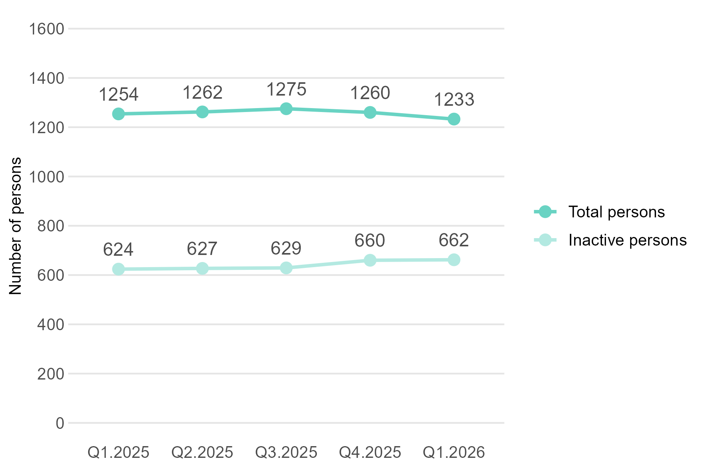{width=80%}

 

|Indicator                                   |Current quarter  |Change on previous quarter                          |
|--------------------------------------------|----------------:|---------------------------------------------------:|
|Number of patients on wait list             |1326             |-9 patients (-0.7 %)                                |
|Percentage inactive                         |48.8 %           |-1.1 percentage points                              |

### 1.2 People on the wait list by organ

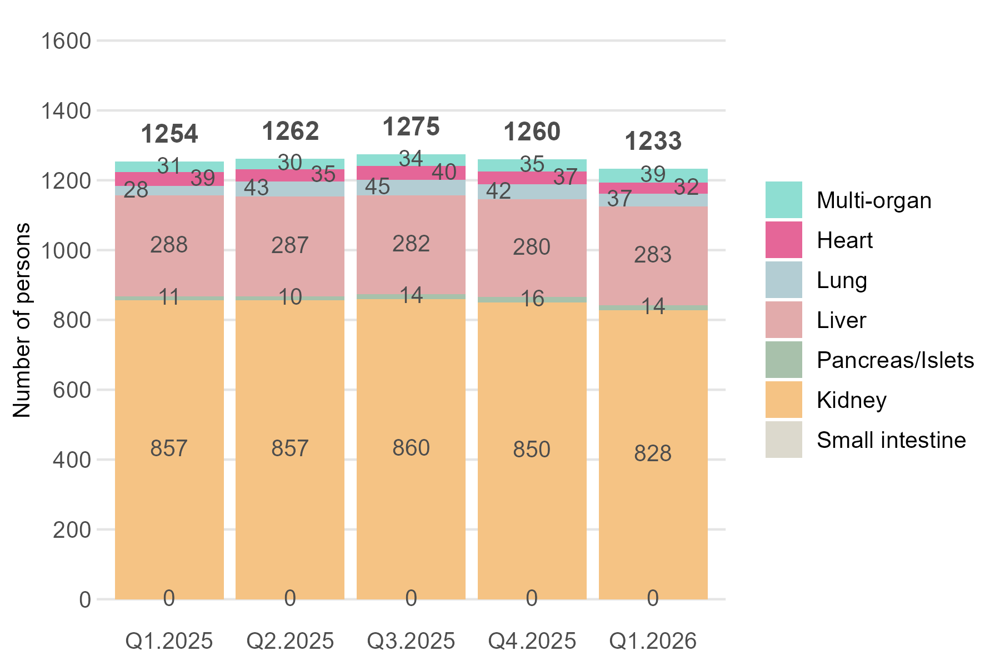{width=80%}

 

|Indicator                                   |Current quarter       |Change on previous quarter                    |
|--------------------------------------------|---------------------:|---------------------------------------------:|
|Number of patients on wait list:            |1326                  |-9 patients (-0.7 %)                          |
|Multi-Organ                                 |40                    |-2 patients (-4.8 %)                          |
|Heart                                       |43                    |+1 patient (+2.4 %)                           |
|Lung                                        |42                    |-4 patients (-8.7 %)                          |
|Liver                                       |281                   |+13 patients (+4.9 %)                         |
|Kidney                                      |907                   |-16 patients (-1.7 %)                         |
|Pancreas/islets                             |13                    |-1 patient (-7.1 %)                           |
|Small bowel                                 |0                     |+/- 0 patients                                |

### 1.3 Events on the wait list

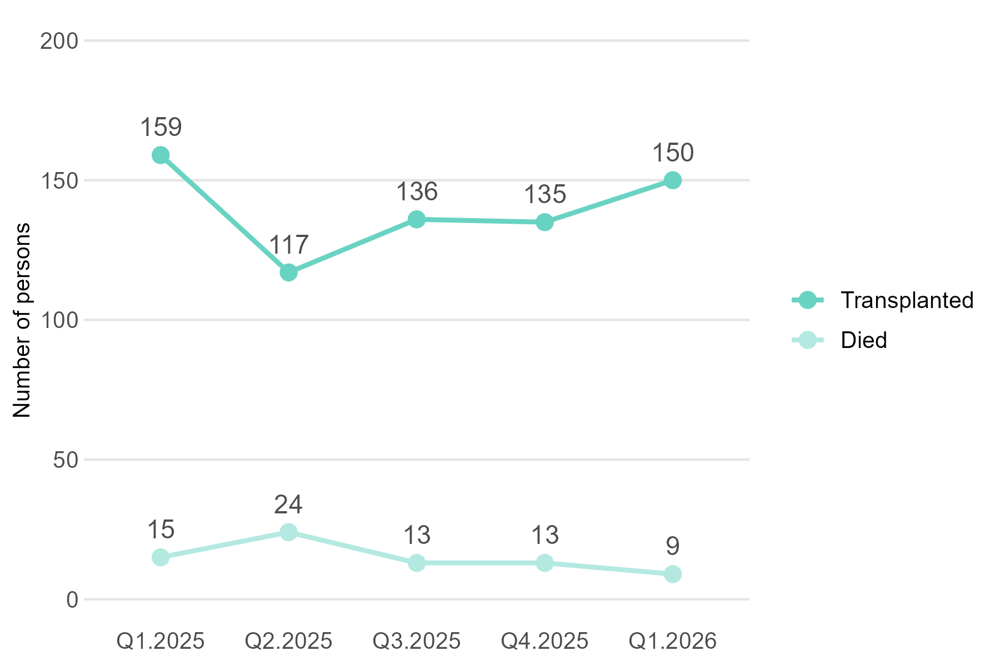{width=80%}

 

|Indicator                                   |Current quarter        |Change on previous quarter                     |
|--------------------------------------------|----------------------:|----------------------------------------------:|
|Number of patients transplanted             |102                    |-36 patients (-26.1 %)                         |
|Number of patients deceased                 |27                     |+8 patients (+29.6 %)                          |

::: {.callout-note title="Exemple de lecture"}
In the first quarter of 2024, 102 patients in Switzerland received one or more organs from deceased organ donation. 27 patients died on the waiting list.
:::

:::

::: {.content-visible when-profile="de"}

## 2. Organspende

Hier finden Sie Kennzahlen zur Organspende nach dem Tod und zur Organ-Lebendspende in der Schweiz.

::: {.callout-tip title="Das Wichtigste in Kürze"}
Im ersten Quartal 2026 haben in der Schweiz 55 Personen ihre Organe nach dem Tod gespendet, 12 Person mehr als im Vorquartal und so viele wie noch nie in den letzten 5 Quartalen. Von den 55 Personen waren 31 (56 %) im Hirntod nach Herz-Kreislauf-Stillstand (DCD). 157 Organe von verstorbenen spendenden Personen wurden in der Schweiz transplantiert, das sind 17 mehr (+12 %) als im Vorquartal. Durchschnittlich wurden 2.7 Organe pro spendende verstorbene Person transplantiert, dieser Wert ist also gegenüber dem Vorquartal wieder leicht gesunken.
:::

### 2.1 Für eine Organspende nach dem Tod freigegebene Personen

![**Abb. 2.1** In der Schweiz von Swisstransplant für die Organspende nach dem Tod freigegebene verstorbene Personen. Eine Person wird freigegeben, wenn bei aussichtloser Prognose eine Zustimmung zur Organspende vorliegt und sie medizinisch für eine Organspende mindestens eines Organs qualifiziert. «Utilisiert» bedeutet, es konnte mindestens ein Organ transplantiert werden. «Effektiv» bedeutet, ein chirurgischer Eingriff mit der Absicht zur Organentnahme zum Zweck einer Transplantation erfolgte, aber kein Organ konnte transplantiert werden. «Nicht utilisiert» bedeutet, es kam nicht zu einem chirurgischen Eingriff mit der Absicht zur Organentnahme zum Zweck einer Transplantation.](Fig2.1-de.png){width=80%}

 

|Indikator                               |Letztes Quartal        |Veränderung zum Vorquartal                  |
|----------------------------------------|----------------------:|-------------------------------------------:|
|Anzahl freigegebene Personen            |60                     |+14 Personen (+30 %)                          |
|Anteil Nicht utilisierte                |8 %                    |+1 Prozentpunkt                            |
|Anteil Effektive                        |8 %                    |+4 Prozentpunkte                            |
|Anteil Utilisierte                      |83 %                   |-6 Prozentpunkte                            |

::: {.callout-note title="Lesebeispiel"}
Im letzten Quartal hat Swisstransplant 60 Personen aus der Schweiz für eine Organspende nach dem Tod freigegeben. Das sind 14 Personen mehr (+30 %) als im Vorquartal. Die Utilisierungsrate betrug 83 %, 6 Prozentpunkte weniger als im Vorquartal.
:::

### 2.2 Spendende verstorbene Personen

{width=80%}

 

|Indikator                                 |Letztes Quartal     |Veränderung zum Vorquartal  |
|------------------------------------------|-------------------:|---------------------------:|
|Anzahl spendende Personen (alle)          |55                  |+12 (+28 %)                 |
|DCD                                       |31 (56 %)           |+9 (+41 %)                  | 
|DBD                                       |24 (44 %)           |+3 (+14 %)                  |

::: {.callout-note title="Lesebeispiel"}
Im letzten Quartal haben in der Schweiz 55 Personen ihre Organe nach dem Tod gespendet. Im Vergleich zum Vorquartal sind das 12 Person mehr (+28 %). Von den 55 spendenden verstorbenen Personen waren 31 (56 %) im Hirntod nach Herz-Kreislauf-Stillstand (DCD). 
:::

### 2.3 Transplantierte Organe von spendenden verstorbenen Personen

{width=80%}

 

|Indikator                                 |Letztes Quartal      |Veränderung zum Vorquartal  |
|------------------------------------------|--------------------:|---------------------------:|
|Anzahl transplantierte Organe (alle)      |157                  |+17 (+12 %)                 |
|Herz                                      |16                   |+4 (+33 %)                  |
|Lunge                                     |19                   |-2 (-10 %)                  |
|Leber                                     |34                   |+3 (+10 %)                  |
|Niere                                     |84                   |+13 (+18 %)                 |
|Pankreas/Inselzellen                      |4                    |-1 (-20 %)                  |

::: {.callout-note title="Lesebeispiel"}
Im letzten Quartal wurden in der Schweiz 157 Organe von spendenden verstorbenen Personen transplantiert. Im Vergleich zum Vorquartal sind das 17 Organe mehr (+12 %). Insbesondere wurden wieder mehr Herzen und Nieren transplantiert.
:::

### 2.4 Transplantierte Organe pro spendende verstorbene Person

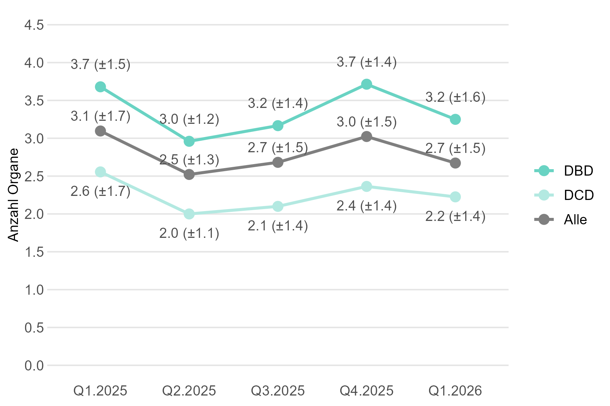{width=80%}

 

|Indikator                                |Letztes Quartal     |Veränderung zum Vorquartal             |
|-----------------------------------------|-------------------:|--------------------------------------:|
|Organe pro spendende Person (alle)       |2.7                 |-0.3                                   |
|DBD                                      |3.2                 |-0.5                                   |
|DCD                                      |2.2                 |+0.2                                   |

::: {.callout-note title="Lesebeispiel"}
Im letzten Quartal wurden in der Schweiz durchschnittlich 2.7 Organe pro spendende verstorbene Person transplantiert. Im Vergleich zum Vorquartal sind das 0.3 Organe weniger.
:::

### 2.5 Spendende lebende Personen

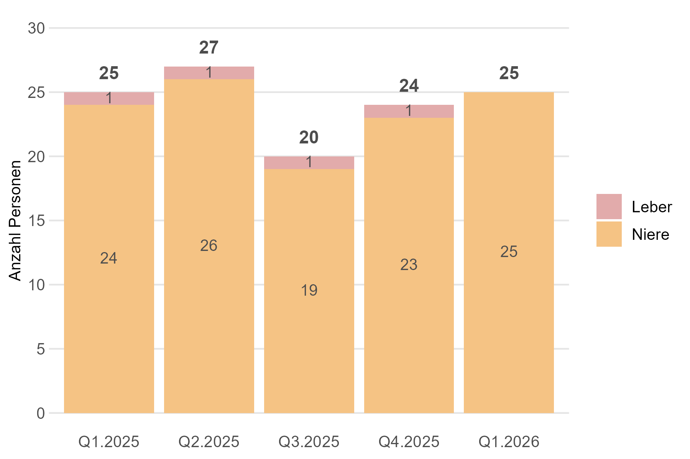{width=80%} 

 

|Indikator                                   |Letztes Quartal     |Veränderung zum Vorquartal      |
|--------------------------------------------|-------------------:|-------------------------------:|
|Anzahl spendende Personen (alle)            |25                  |+1 (+4 %)                       |
|Leber                                       |0 (0 %)             |-1                              |
|Niere                                       |25 (100 %)          |+2                              |

::: {.callout-note title="Lesebeispiel"}
Im letzten Quartal haben in der Schweiz 25 lebende Personen eine ihrer Nieren gespendet. Das ist 1 Lebendspende mehr als im Vorquartal.
:::

:::

::: {.content-visible when-profile="fr"}
## 2. Don d'organes
Vous trouverez ici les chiffres clés sur le don d'organes après le décès et le don d'organes de donneurs vivants en Suisse.

::: {.callout-tip title="L'essentiel en bref"}
Au premier trimestre 2026, 55 personnes ont fait don de leurs organes après leur décès en Suisse. C'est 12 personnes de plus comparé au trimestre précédent, soit un nombre jamais atteint au cours des cinq derniers trimestres. Parmi ces 55 personnes décédées, 31 (56 %) étaient en état de mort cérébrale après un arrêt cardio-circulatoire (DCD). 157 organes de donneurs décédés ont été transplantés en Suisse, soit 17 de plus (+12 %) qu'au trimestre précédent. En moyenne, 2.7 organes par donneur décédé ont été transplantés, ce qui représente une légère baisse par rapport au trimestre précédent.
:::

### 2.1 Personnes approuvées à faire un don d'organes après le décès

![**Fig. 2.1** Personnes décédées en Suisse et approuvées par Swisstransplant pour le don d'organes après le décès. Une personne est approuvée si, en cas de pronostic sans espoir, elle a donné son consentement au don d'organes et qu'elle est médicalement qualifiée pour le don d'au moins un organe. « Utilisées » signifie qu'au moins un organe a pu être transplanté. « Effectives » signifie qu'une intervention chirurgicale a eu lieu avec l'intention de prélever un organe en vue d'une transplantation, mais qu'aucun organe n'a pu être transplanté. « Non utilisées » signifie qu'il n'y a pas eu d'intervention chirurgicale dans l’intention d’un prélèvement d’organes aux fins d’une transplantation.](Fig2.1-fr.png){width=80%}

 

|Indicateur                               |Dernier trimestre        | Changement par rapport au trimestre précédent  |
|-----------------------------------------|------------------------:|-----------------------------------------------:|
|Nombre de personnes approuvées           |60                       |+14 Personen (+30 %)                            |
|Proportion de personnes non utilisées    |8 %                      |+1 point de pourcentage                         |
|Proportion de personnes effectives       |8 %                      |+4 points de pourcentage                        |
|Proportion de personnes utilisées        |83 %                     |-6 points de pourcentage                        |

::: {.callout-note title="Exemple de lecture"}
Au dernier trimestre, Swisstransplant a approuvé 60 personnes en Suisse pour un don d'organe après le décès. Ce sont 14 personnes de plus (+30 %) qu'au trimestre précédent. Le taux d'utilisation était de 83 %, soit 6 points de pourcentage de moins qu'au trimestre précédent.
:::

### 2.2 Donneurs décédés

{width=80%}

 

|Indicateur                                  |Dernier trimestre      |Changement par rapport au trimestre précédent  |
|--------------------------------------------|----------------------:|----------------------------------------------:|
|Nombre de donneurs (tous)                   |55                     |+12 (+28 %)                                    |
|DCD                                         |31 (56 %)              |+9 (+41 %)                                     |
|DBD                                         |24 (44 %) 	           |+3 (+14 %)                                     |

::: {.callout-note title="Exemple de lecture"}
Au dernier trimestre, 55 personnes ont fait don de leurs organes après leur décès en Suisse. Par rapport au trimestre précédent, cela représente 12 personne de plus (+28 %). Parmi ces 55 personnes décédées, 31 (56 %) étaient des donneurs en état de mort cérébrale après un arrêt cardio-circulatoire (DCD).
:::

### 2.3 Organes transplantés de donneurs décédés

{width=80%}

 

|Indicateur                                  |Dernier trimestre      |Changement par rapport au trimestre précédent |
|--------------------------------------------|----------------------:|---------------------------------------------:|
|Nombre d'organes transplantés (tous)        |157                    |+17 (+12 %)                                   |
|Cœur                                        |16                     |+4 (+33 %)                                    |
|Poumons                                     |19                     |-2 (-10 %)                                    |
|Foie                                        |34                     |+3 (+10 %)                                    |
|Reins                                       |84                     |+13 (+18 %)                                   |
|Pancréas/cellules des îlots                 |4                      |-1 (-20 %)                                    |

::: {.callout-note title="Exemple de lecture"}
Au dernier trimestre, 157 organes ont été transplantés en Suisse de donneurs décédés. Par rapport au trimestre précédent, cela représente 17 organes de plus (+12 %). En particulier, le nombre de transplantations de cœur et de rein a de nouveau augmenté.
:::

### 2.4 Organes transplantés par donneur décédé

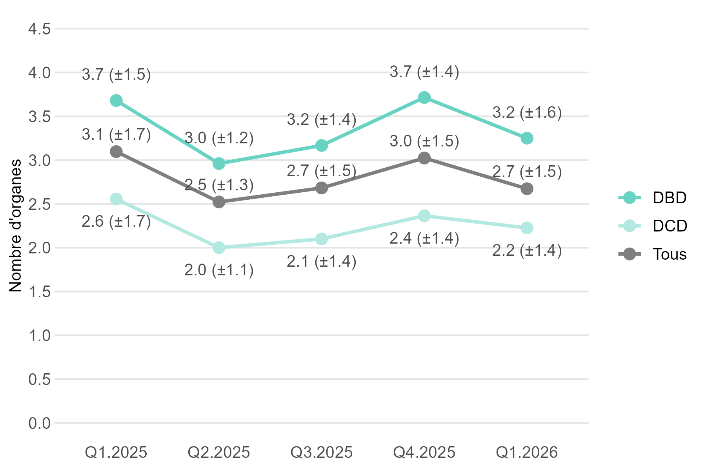{width=80%}

 

|Indicateur                               |Dernier trimestre    |Changement par rapport au trimestre précédent |
|-----------------------------------------|-------------------:|----------------------------------------------:|
|Organes par donneur (tous)               |2.7	               |-0.3                                           |
|DBD                                      |3.2                 |-0.5                                           |
|DCD                                      |2.2                 |+0.2                                           |
  

::: {.callout-note title="Exemple de lecture"}
Au dernier trimestre, 2.7 organes ont été transplantés en moyenne en Suisse par donneur décédé. Par rapport au trimestre précédent, cela représente 0.3 organe de moins.
:::

### 2.5 Donneurs vivants

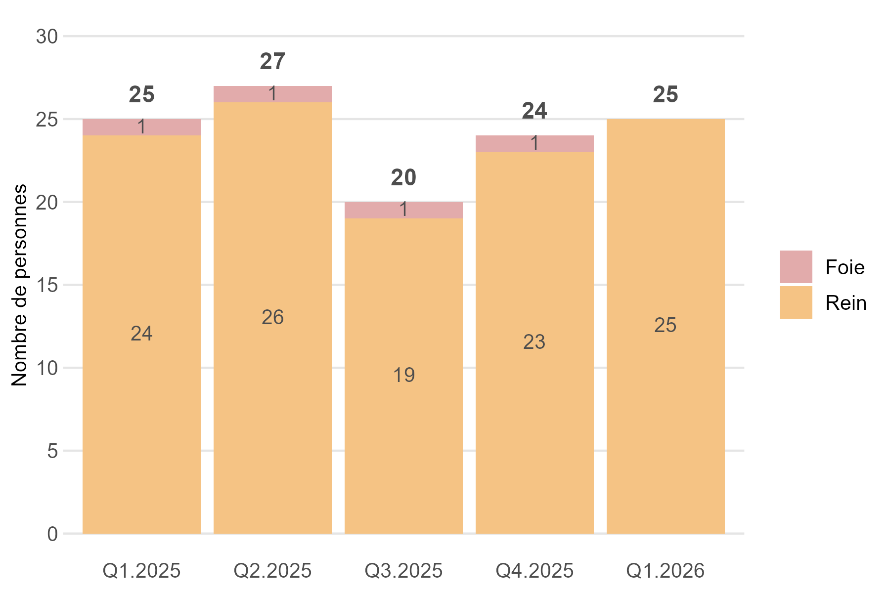{width=80%}

 

|Indicateur                                  |Dernier trimestre    |Changement par rapport au trimestre précédent |
|--------------------------------------------|--------------------:|---------------------------------------------:|
|Nombre de donneurs vivants (tous)           |25                   |+1 (+4 %)                                     |
|Foie                                        |0 (0 %)	             |-1                                            |
|Rein                                        |25 (100 %)           |+2                                            |

::: {.callout-note title="Exemple de lecture"}
Au cours du dernier trimestre, 25 personnes vivantes en Suisse ont fait don d'un de leurs reins. Cela représente 1 don de personnes vivantes de plus qu'au trimestre précédent.
:::

:::

::: {.content-visible when-profile="en"}
## 2. Organ donation

ENTIRE ENGLISH SECTION NEEDS TRANSLATION AND NUMBERS IN TABLES AER NOT UPDATED!!!

## 2.1 People approved for deceased organ donation

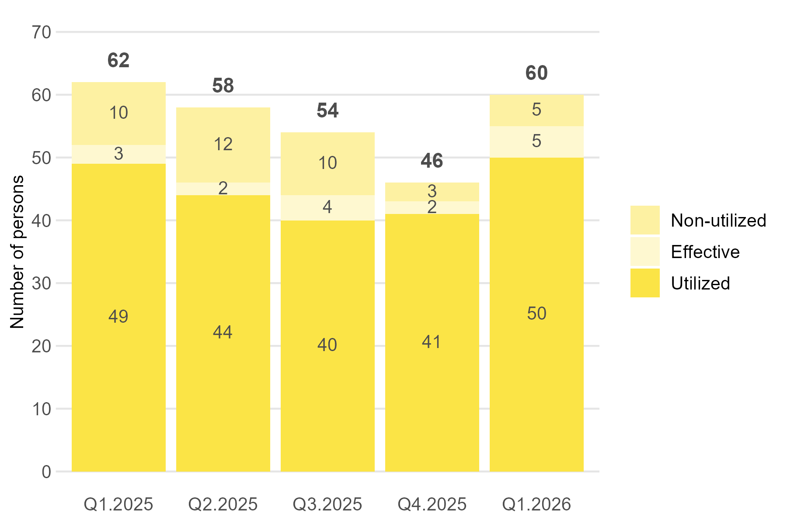{width=80%}

### 2.2 Deceased donors

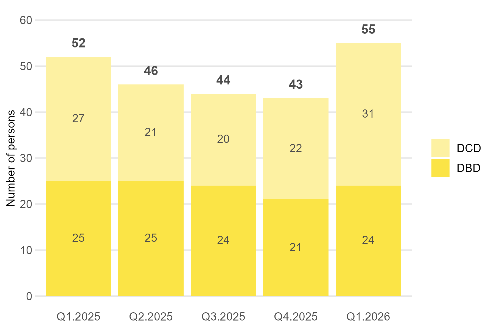{width=80%}

### 2.3 Organs transplanted from deceased donors

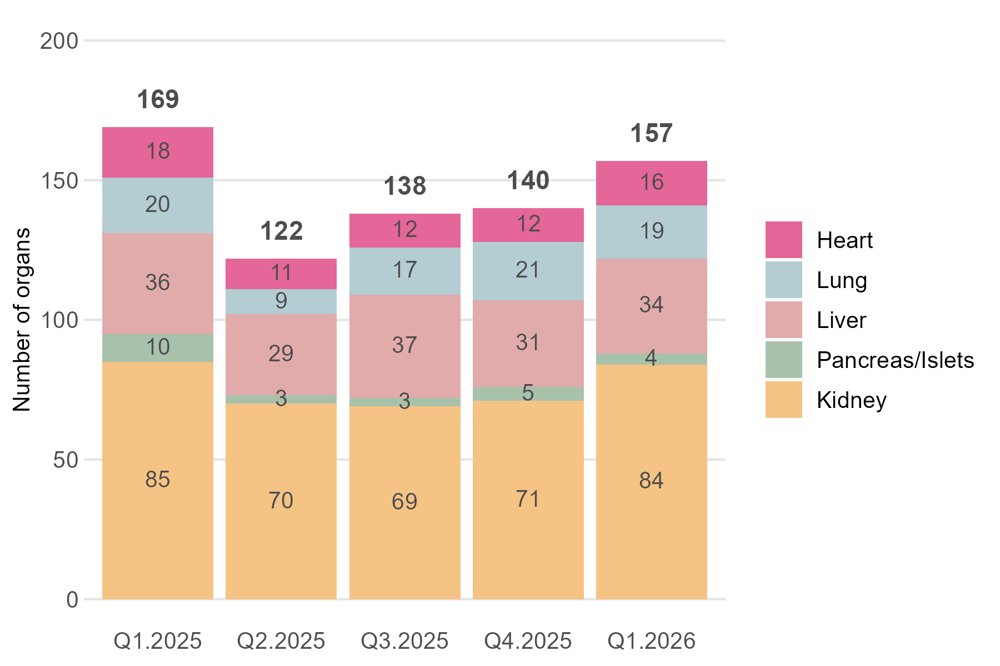{width=80%}

### 2.4 Organs transplanted per deceased donor

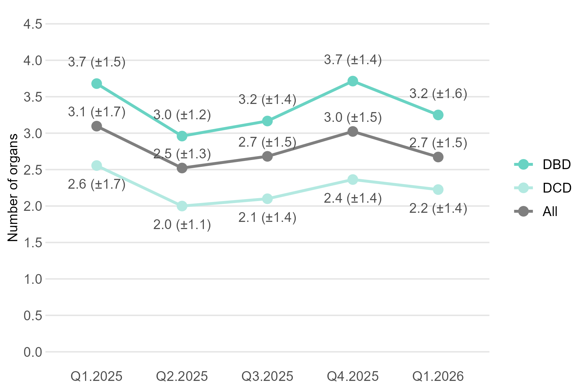{width=80%}

### 2.5 Living donors

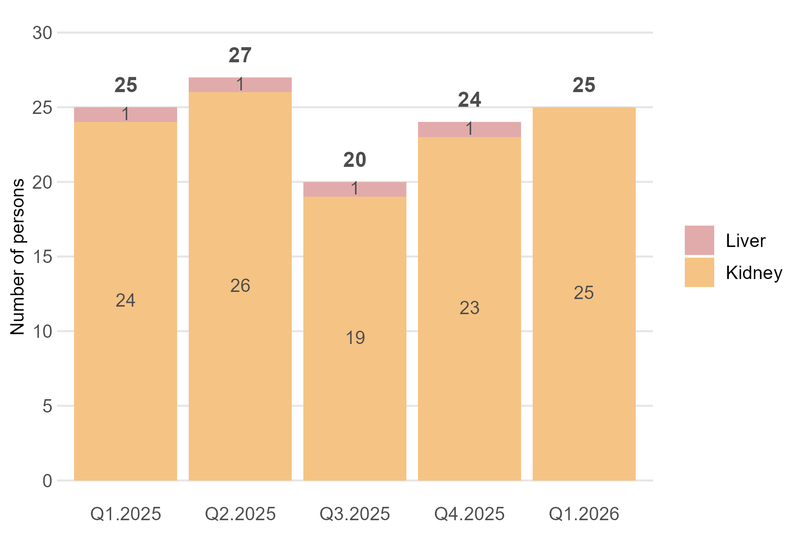{width=80%}

:::

::: {.content-visible when-profile="de"}
## 3. Transplantationen

Hier finden Sie Kennzahlen zu Personen, die ein Organ von einer spendenden verstorbenen Person erhielten. Einerseits sind dies Personen in der Schweiz, die ein Organ von einer spendenden verstorbenen Person aus der Schweiz oder aus dem Ausland erhielten. Andererseits sind dies Personen im Ausland, die ein Organ von einer verstorbenen Person aus der Schweiz erhielten, wenn in der Schweiz für ein Organ keine passende Person gefunden werden konnte. Kennzahlen zur Lebendspende von Niere und Leber finden Sie unter [2.5](https://data.swisstransplant.org/posts/2025-Q4/#spendende-lebende-personen).

::: {.callout-tip title="Das Wichtigste in Kürze"}
Im ersten Quartal 2026 erhielten in der Schweiz 150 Personen eines oder mehrere Organe von spendenen verstorbenen Personen. Im Vergleich zum vierten Quartal 2025 sind das 15 Transplantation mehr (+11 %). Von den 150 Personen erhielten 14 Personen (9 %) ein Organ aus dem Ausland.
:::

### 3.1 In der Schweiz transplantierte Personen

{width=80%}

 

|Indikator                                    |Letztes Quartal       |Veränderung zum Vorquartal            |
|---------------------------------------------|---------------------:|-------------------------------------:|
|Anzahl transplantierte Personen (alle)       |150                   |+15 (+11 %)                           |
|Multiorgan                                   |5                     |0 (+/-0 %)                            |
|Herz                                         |16                    |+4 (+33 %)                            |
|Lunge                                        |18                    |-3 (-14 %)                            |
|Leber                                        |32                    |+3 (+10 %)                            |
|Niere                                        |78                    |+12 (+18 %)                           |
|Pankreas/Inselzellen                         |1                     |-1 (-50 %)                            |

::: {.callout-note title="Lesebeispiel"}
Im letzten Quartal erhielten in der Schweiz 150 Personen eines oder mehrere Organe von spendenden verstorbenen Personen. Im Vergleich zum Vorquartal ist das 15 Transplantationen mehr (+11 %). Im letzten Quartal erhielten 5 Personen mehr als 1 Organ gleichzeitig ("Multiorgan"), 3 Personen erhielten je eine Niere und einen Pankreas/Inselzellen, 1 Person erhielt eine Niere und eine Leber und 1 Person erhielt eine Lunge und eine Leber.
:::

### 3.2 In der Schweiz transplantierte Personen mit Organen aus dem Ausland

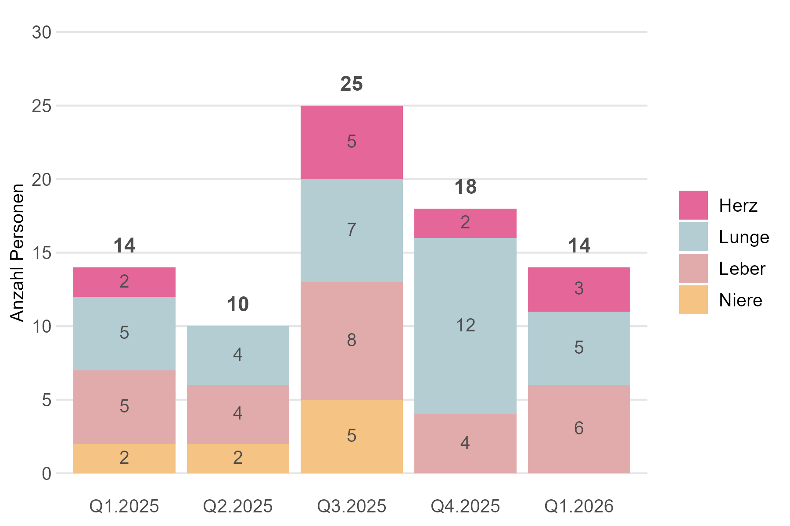{width=80%}

 

|Indikator                                      |Letztes Quartal       |Veränderung zum Vorquartal              |
|-----------------------------------------------|----------------------|---------------------------------------:|
|Anzahl transplantierte Personen mit Organen aus dem Ausland |14       |-4 (-22 %)                            |

::: {.callout-note title="Lesebeispiel"}
Im letzten Quartal erhielten in der Schweiz 14 Personen Organe von spendenden verstorbenen Personen aus dem Ausland. Das sind 4 Personen weniger als im Vorquartal (-22 %).
:::

### 3.3 Im Ausland transplantierte Organe

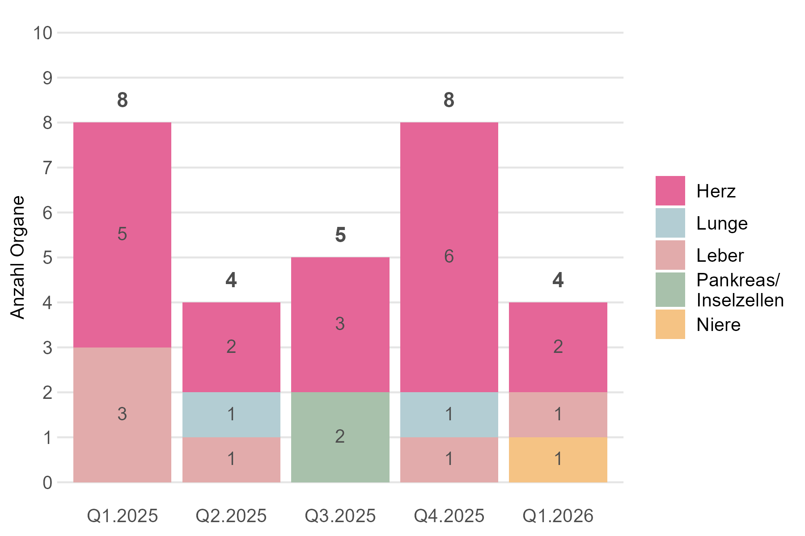{width=80%}

 

|Indikator                                         |Letztes Quartal     |Veränderung zum Vorquartal              |
|--------------------------------------------------|-------------------:|---------------------------------------:|
|Anzahl transplantierte Organe im Ausland          |4                   |-4 (-50 %)                              |

::: {.callout-note title="Lesebeispiel"}
Im letzten Quartal wurden 4 Organe von spendenden verstorbenen Personen aus der Schweiz im Ausland transplantiert. Im Vergleich zum Vorquartal sind das halb so viele Organe.
:::

### 3.4 Herztransplantationen

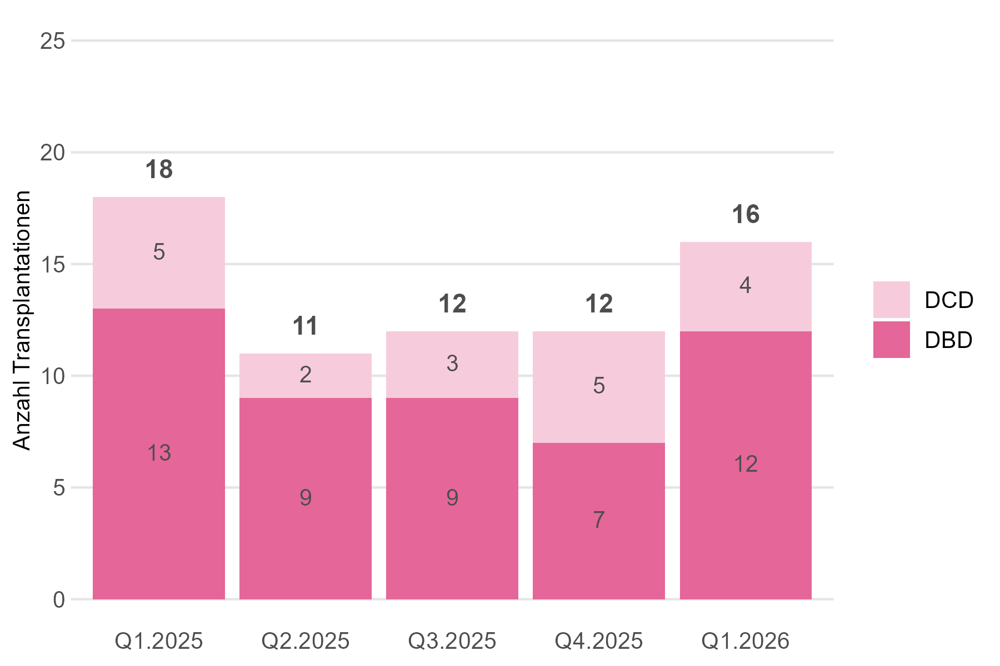{width=80%}

 

|Indikator                                   |Letztes Quartal          |Veränderung zum Vorquartal             |
|--------------------------------------------|------------------------:|--------------------------------------:|
|Anzahl Herztransplantationen (alle)         |16                       |+4 (+33 %)                                 |
|DCD                                         |4 (25 %)                 |-1                                     |
|DBD                                         |12 (75 %)                |+5                                     |

::: {.callout-note title="Lesebeispiel"}
Im letzten Quartal erhielten in der Schweiz 16 Personen eine Herztransplantation. Das sind 4 mehr als im Vorquartal.
:::

### 3.5 Lungentransplantationen

{width=80%}

 

|Indikator                                   |Letztes Quartal          |Veränderung zum Vorquartal              |
|--------------------------------------------|------------------------:|---------------------------------------:|
|Anzahl Lungentransplantationen (alle)       |19                       |-2 (-10 %)                              |
|DCD                                         |8 (42 %)                 |+5                                      |
|DBD                                         |11 (58 %)                |-7                                      |

::: {.callout-note title="Lesebeispiel"}
Im letzten Quartal erhielten in der Schweiz 19 Personen eine Lungentransplantation. Im Vergleich zum Vorquartal sind das 2 Lungentransplantationen weniger.
:::

### 3.6 Lebertransplantationen

{width=80%}

 

|Indikator                                   |Letztes Quartal         |Veränderung zum Vorquartal              |
|--------------------------------------------|-----------------------:|---------------------------------------:|
|Anzahl Lebertransplantationen (alle)        |34                      |+3 (+10 %)                              |
|DCD                                         |13 (38 %)               |+2                                      |
|DBD                                         |21 (62 %)               |+1                                      |

::: {.callout-note title="Lesebeispiel"}
Im letzten Quartal erhielten in der Schweiz 34 Personen eine Lebertransplantation aus einer Organspende nach dem Tod. Im Vergleich zum Vorquartal sind das 3 Lebertransplantationen mehr.
:::

### 3.7 Nierentransplantationen

{width=80%}

 

|Indikator                                   |Letztes Quartal         |Veränderung zum Vorquartal              |
|--------------------------------------------|-----------------------:|---------------------------------------:|
|Anzahl Nierentransplantationen (alle)       |82                      |+11 (+15 %)                               |
|DCD                                         |44 (54 %)               |+11                                      |
|DBD                                         |38 (46 %)               |+/-0                                      |

::: {.callout-note title="Lesebeispiel"}
Im letzen Quartal erhielten in der Schweiz 82 Personen eine Nierentransplantation aus einer Organspende nach dem Tod. Im Vergleich zum Vorquartal sind das 11 Nierentransplantation mehr.
:::

### 3.8 Pankreas/Inselzellen-Transplantationen

{width=80%}

 

|Indikator                                             |Letztes Quartal          |Veränderung zum Vorquartal     |
|------------------------------------------------------|------------------------:|------------------------------:|
|Anzahl Pankreas-/Inselzellen-Transplantationen (alle) |4                        |-1 (-20 %)                     |
|DCD                                                   |0 (0  %)                 |-1                             |
|DBD                                                   |4 (100 %)                |+/-0                             |

::: {.callout-note title="Lesebeispiel"}
Im letzten Quartal erhielt in der Schweiz 4 Personen eine Pankreas/Inselzellen-Transplantation. Im Vergleich zum Vorquartal ist das 1 Pankreas/Inselzellen-Transplantatione weniger.
:::

:::

::: {.content-visible when-profile="fr"}
## 3. Transplantations

Vous trouverez ici les chiffres clés sur les patients qui ont reçu un organe d'un donneur décédé. Il s'agit d'une part de patients Suisse qui ont reçu un organe d'un donneur décédé en Suisse ou à l'étranger. D'autre part, il s'agit de personnes à l'étranger qui ont reçu un organe d'une personne décédée en Suisse, lorsqu'aucune personne compatible n'a pu être trouvée en Suisse. Vous trouverez les chiffres clés concernant le don de rein et de foie par des donneurs vivants au point [2.5](https://data.swisstransplant.org/fr/posts/2025-Q2/#donneurs-vivants).

::: {.callout-tip title="L'essentiel en bref"}
Au premier trimestre 2026, 150 personnes ont reçu en Suisse un ou plusieurs organes de donneurs décédées. Par rapport au trimestre précédent, cela représente 15 transplantation de plus (+11 %). Parmi les 150 patients, 14 (9 %) ont reçu un organe provenant de l'étranger.
:::

### 3.1 Patients transplantés en Suisse

{width=80%}

 

|Indicateur                               |Dernier trimestre     | Changement par rapport au trimestre précédent |
|-----------------------------------------|---------------------:|----------------------------------------------:|
|Nombre de patients transplantés (tous)   |150                   |+15 (+11 %)                                    |
|Multi-organes                            |5                     |0 (+/-0 %)                                     |
|Cœur                                     |16                    |+4 (+33 %)                                     |
|Poumons                                  |18                    |-3 (-14 %)                                     |
|Foie                                     |32                    |+3 (+10 %)                                     |
|Reins                                    |78                    |+12 (+18 %)                                    |
|Pancréas/cellules des îlots              |1                     |-1 (-50 %)                                     |

::: {.callout-note title="Exemple de lecture"}
Au dernier trimestre, 150 personnes ont reçu en Suisse un ou plusieurs organes de donneurs décédés. Par rapport au trimestre précédent, cela représente 15 transplantation de plus (+11 %). 5 personnes ont reçu plus d'un organe à la fois (« Multi-organes »), 3 personnes ont reçu chacune un rein et un pancréas/des cellules des îlots, 1 personne a reçu un rein et un foie, et 1 personne a reçu un poumon et une fois.
:::

### 3.2 Patients transplantés en Suisse avec des organes de l'étranger

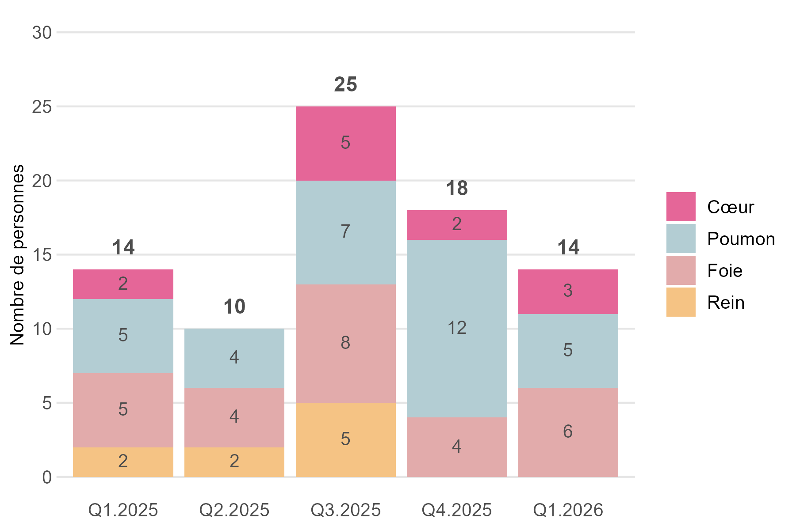{width=80%}

 

|Indicateur                                     |Dernier trimestre        |Changement par rapport au trimestre précédent |
|-----------------------------------------------|------------------------:|----------------------------------------:|
|Nombre de patients transplantés avec des organes provenant de l'étranger |14            |-4 (-22 %)                        |

::: {.callout-note title="Exemple de lecture"}
Au dernier trimestre, 14 patients ont reçu en Suisse des organes provenant de donneurs décédés à l'étranger. Cela fait 4 personnes de moins (-22 %) qu'au trimestre précédent.
:::

### 3.3 Organes transplantés à l'étranger

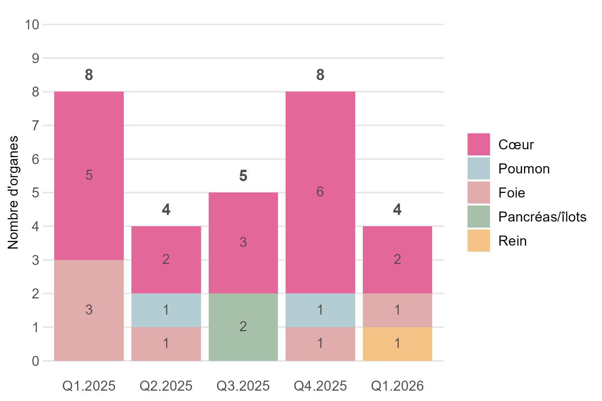{width=80%}

 

|Indicateur                                       |Dernier trimestre    |Changement par rapport au trimestre précédent |
|-------------------------------------------------|-------------------:|----------------------------------------------:|
|Nombre d'organes transplantés à l'étranger     |4                     |-4 (-50 %)                                     |

::: {.callout-note title="Exemple de lecture"}
Au dernier trimestre, 4 organes provenant de donneurs décédés en Suisse ont été transplantés à l'étranger. Par rapport au trimestre précédent, cela représente deux fois moins d'organes.
:::

### 3.4 Transplantations du cœur

{width=80%}

 

|Indicateur                                  |Dernier trimestre       |Changement par rapport au trimestre précédent |
|--------------------------------------------|-----------------------:|---------------------------------------:|
|Nombre de transplantations du coeur         |16                      |+4 (+33 %)                              |
|DCD                                         |4 (25 %)                |-1                                      |
|DBD                                         |12 (75 %) 	            |+5                                      |

::: {.callout-note title="Exemple de lecture"}
Au dernier trimestre, 16 personnes ont reçu une transplantation cardiaque en Suisse. C'est 4 de plus que lors du trimestre précédent.
:::

### 3.5 Transplantations de poumons

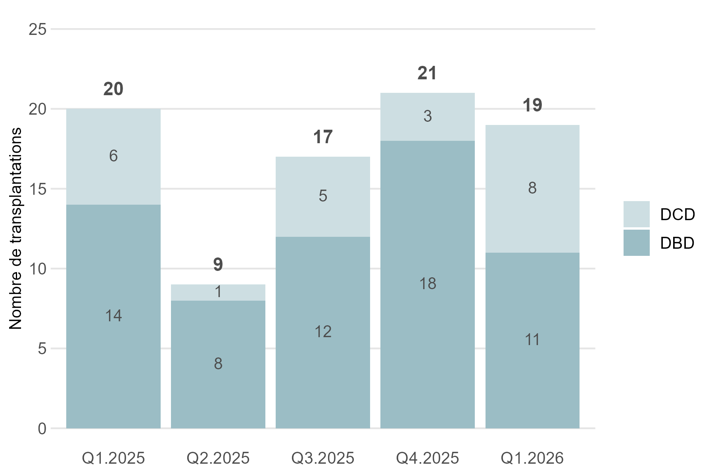{width=80%}

 

|Indicateur                                  |Dernier trimestre    |Changement par rapport au trimestre précédent |
|--------------------------------------------|------------------------:|---------------------------------------:|
|Nombre de transplantations de poumons       |19                       |-2 (-10 %)                             |
|DCD                                         |8 (42 %) 	               |+5                                      |
|DBD                                         |11 (58 %)                |-7                                      |

::: {.callout-note title="Exemple de lecture"}
Au dernier trimestre, 19 personnes ont reçu une transplantation pulmonaires en Suisse. Par rapport au trimestre précédent, cela représente 2 transplantations pulmonaires de moins.
:::

### 3.6 Transplantations du foie

{width=80%}

 

|Indicateur                                  |Dernier trimestre    |Changement par rapport au trimestre précédent |
|--------------------------------------------|-----------------------:|------------------------------------------:|
|Nombre de transplantations du foie (tous)   |34                      |+3 (+10 %)                                 |
|DCD                                         |13 (38 %) 	            |+2                                     |
|DBD                                         |21 (62 %) 	            |+1                                         |

::: {.callout-note title="Exemple de lecture"}
Au dernier trimestre, 34 personnes ont reçu une transplantation hépatique en Suisse, provenant d'un don d'organe après le décès. Par rapport au trimestre précédent, cela représente 3 transplantations hépatiques de moins.
:::

### 3.7 Transplantations de reins

{width=80%}

 

|Indicateur                                  |Dernier trimestre    |Changement par rapport au trimestre précédent |
|--------------------------------------------|-----------------------:|------------------------------------------:|
|Nombre de transplantations de reins (tous)  |82                      |+11 (+15 %)                                  |
|DCD                                         |44 (54 %) 	            |+11                                         |
|DBD                                         |38 (46 %)               |+/-0                                         |

::: {.callout-note title="Exemple de lecture"}
Au dernier trimestre, 82 personnes ont reçu une transplantation rénale en Suisse, provenant d'un don d'organe après le décès. Par rapport au trimestre précédent, cela représente 11 transplantations rénale de plus.
:::

### 3.8 Transplantations de pancréas et d’cellules des îlots

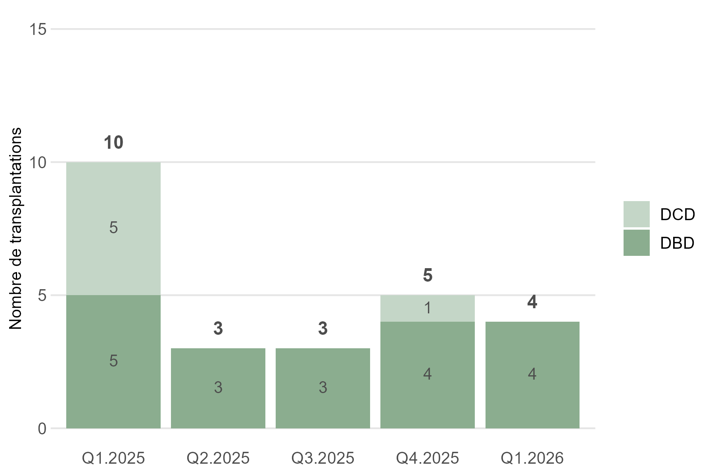{width=80%}

 

|Indicateur                                  |Dernier trimestre    |Changement par rapport au trimestre précédent |
|------------------------------------------------------|------------------------:|-------------------------------:|
|Nombre de transplantations de pancréas et d’îlots (tous) |4                     |-1 (-20 %)                      |
|DCD                                                   |0 (0 %)                  |-1                              |
|DBD                                                   |4 (100 %) 	             |+/-0                            |

::: {.callout-note title="Exemple de lecture"}
Au dernier trimestre, 4 personnes ont reçu une transplantation de pancréas/d’îlots en Suisse. Par rapport au trimestre précédent, cela représente 1 transplantation pancréatiques/d’îlots de moins.
:::

:::

::: {.content-visible when-profile="en"}
## 3. Transplants

ENTIRE ENGLISH SECTION NEEDS TRANSLATION AND NUMBERS IN TABLES AER NOT UPDATED!!!

### 3.1 Patients transplanted in Switzerland

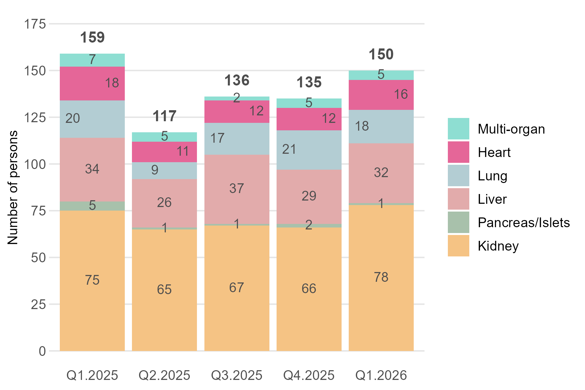{width=80%}
### 3.2 Patients transplanted in Switzerland with organs from abroad

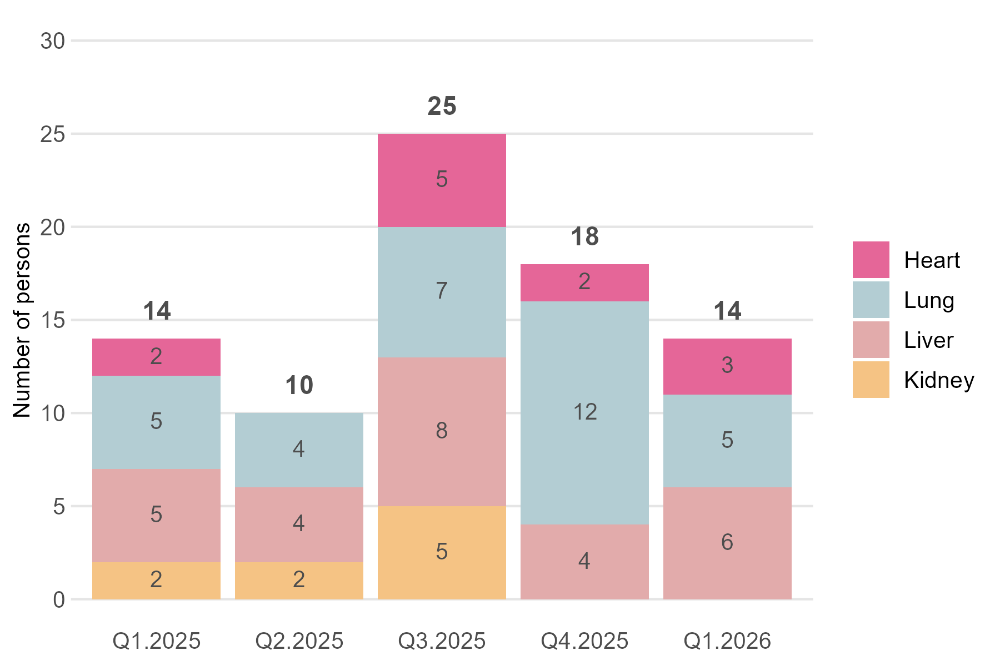{width=80%}

### 3.3 Patients transplanted abroad

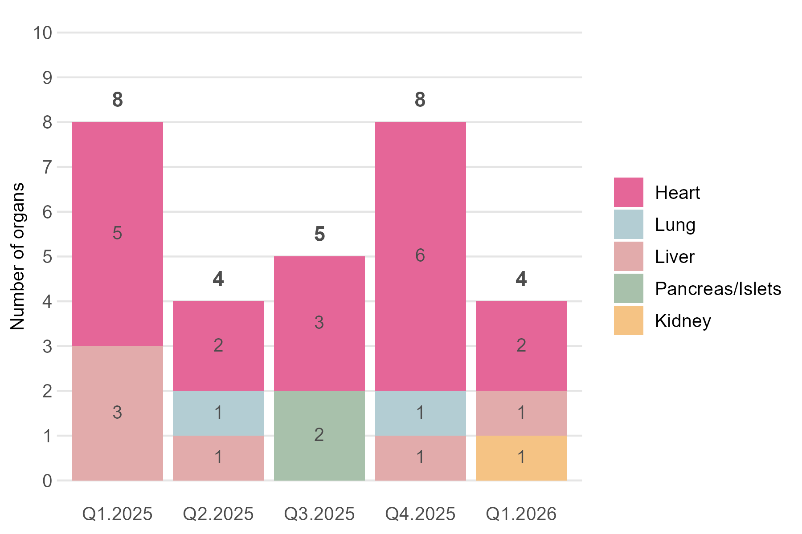{width=80%}

### 3.4 Heart transplants

{width=80%}

### 3.5 Lung transplants

{width=80%}

### 3.6 Liver transplants

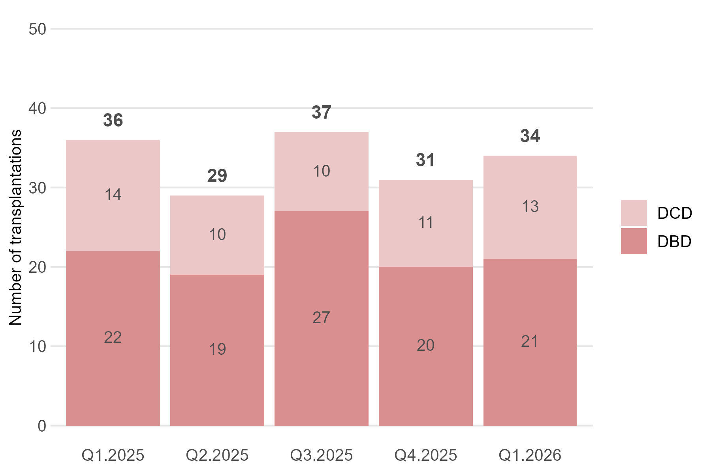{width=80%}

### 3.7 Kidney transplants

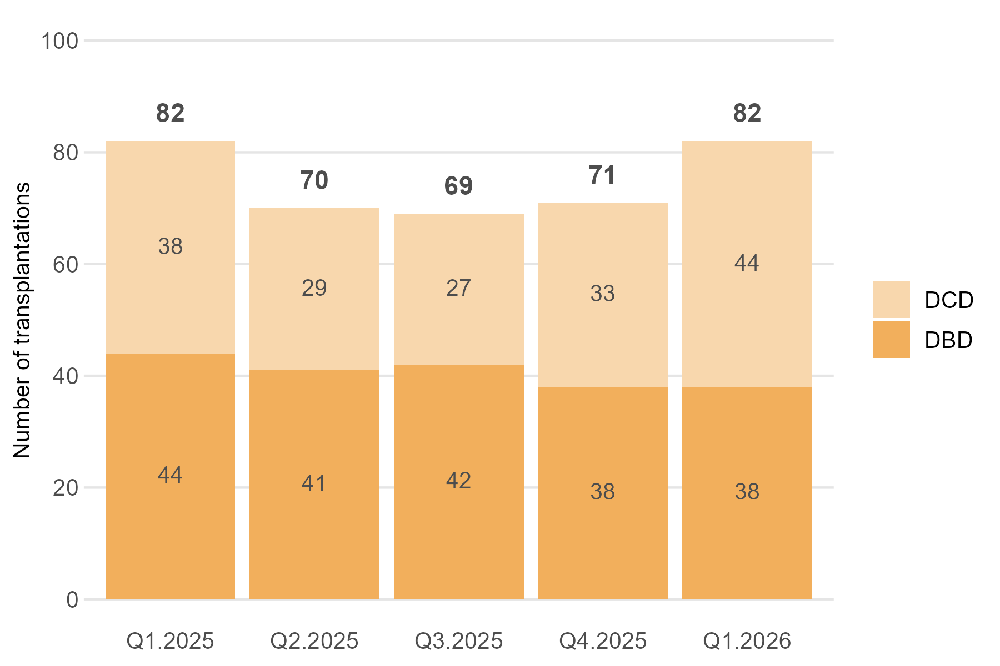{width=80%}

### 3.8 Pancreas/islet cell transplants

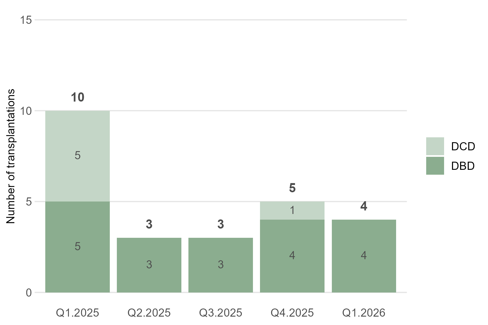{width=80%}
:::