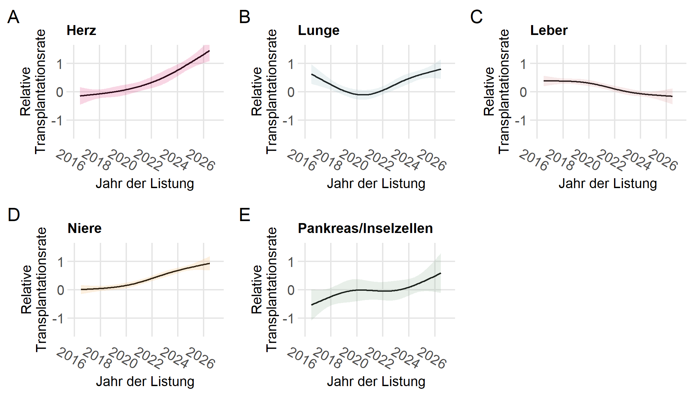

:::::: {.content-visible when-profile="de"}

::: {.callout-note appearance="simple"}
## Das Wichtigste in Kürze

- Die mediane Wartezeit auf eine Niere für eine zwischen 2016 und 2026 neu gelistete Person betrug in der Schweiz knapp 3 Jahre. Für andere Organe waren die Wartezeiten kürzer und lagen zwischen 0.6 und 1.6 Jahren.

- Die Herzwarteliste verzeichnet den stärksten positiven Trend, was vor allem auf moderne Perfusionssysteme zurückzuführen ist, die die Verfügbarkeit von Spenderherzen deutlich erhöhen.

- Es gibt viele Faktoren, welche die Wartezeit auf ein Organ beeinflussen können, wie z.B. die Organverfügbarkeit, die medizinische Dringlichkeit oder die Blutgruppe.
:::

Swisstransplant beobachtet die Entwicklung der nationalen Warteliste für ein Spendeorgan von spendenden verstorbenen Personen und berechnet die Wartezeiten bis zur Transplantation. Jede Patientin, jeder Patient ist jedoch anders. Die individuelle Wartezeit kann deutlich kürzer oder länger sein. Sie hängt von der Organverfügbarkeit, der medizinischen Dringlichkeit, der Blutgruppe und je nach Organ von weiteren Faktoren wie Alter oder Gewicht ab. Die Wahrscheinlichkeiten von kürzlich gelisteten Personen können kürzer sein, da Spende- und Allokationsprozesse kontinuierlich optimiert werden.

::: {.callout-tip appearance="simple"}
## Beobachtungszeitraum

Die hier angegebenen Wartezeiten basieren auf den Daten aller zwischen 1. Juli 2016 und 31. Juni 2026 in der Schweiz neu gelisteten Personen.
:::

## 1. Wahrscheinlichkeit der Transplantation

Die Wahrscheinlichkeit einer Transplantation kann als Kurve über die Zeit dargestellt werden ([Abb. @fig-1]). Die Kurve beginnt bei einer Wahrscheinlichkeit von 0 im Moment der Listung und steigt im Laufe der Wartezeit an, erreicht aber nie den Wert 1, da nicht alle Personen transplantiert werden. Aus der Kurve lassen sich einzelne Werte ablesen, z.B. die Wahrscheinlichkeit, innerhalb eines Jahres transplantiert zu werden, oder die Wartezeit, nach der die Wahrscheinlichkeit einer Transplantation 50 % beträgt (mediane Wartezeit). Insgesamt sind die Chancen auf ein Spenderorgan gut, da die Wahrscheinlichkeit für nahezu alle Organe über 70 % liegt. Die individuellen Wartezeiten können sich jedoch deutlich unterscheiden.

{#fig-1 width="90%"}

## 2. Mediane Wartezeit bis zur Transplantation (MTT)

Als einzelner Kennwert lässt sich die mediane Wartezeit bis zur Transplantation (MTT) aus den vorherigen Kurven ablesen ([Tab. @tbl-1]). Sie entspricht der Wartezeit, bis zu der die Hälfte der Personen ein Organ erhielten und berücksichtigt alle gelisteten Personen, nicht nur Transplantierte. Für viele Organe ist die Wartezeit inzwischen kürzer als der angegebene MTT-Wert, da wir einen Anstieg der Transplantationsrate beobachten.

|                      | MTT in Jahren | 95 %-KI    |
|:---------------------|--------------:|:-----------|
| Herz                 |          0.80 | 0.60--0.94 |
| Lunge                |          0.57 | 0.32--0.88 |
| Leber                |          1.38 | 0.95--1.60 |
| Niere                |          2.81 | 2.41--3.23 |
| Pankreas/Inselzellen |          1.55 | 0.92--1.86 |

: Mediane Wartezeit bis zur Transplantation (MTT) und 95 %-Konfidenzintervall (KI) aller neu gelisteten Personen zwischen 2016–2025. {#tbl-1 .striped .hover}

## 3. Veränderung der Wartezeit über die Zeit

Zur Beurteilung der zeitlichen Entwicklung der Wartezeit wird die Transplantationsrate (Hazard-Rate, siehe Box) herangezogen ([Abb. @fig-2]). Sie zeigt je nach Organ unterschiedliche Trends: Für Herz, Lunge, Niere und Pankreas/Inselzellen beobachten wir einen Anstieg der Transplantationsrate, bei der Leber war in den letzten Jahren ein Rückgang zu beobachten, der sich inzwischen zu stabilisieren scheint.

{#fig-2 width="90%"}

::: {.callout-note appearance="simple"}
## Was ist eine Hazard-Rate?

Die **Hazard-Rate** in der medizinischen Statistik beschreibt die Rate, mit der ein Ereignis wie eine Transplantation in einem kurzen Zeitintervall eintritt – unter der Voraussetzung, dass es bis zu diesem Zeitpunkt noch nicht eingetreten ist. Die Hazard-Rate kann als die **momentane Intensität** des Ereignisses verstanden werden.

Die Hazard-Rate ist keine Wahrscheinlichkeit, sondern eine Rate, die angibt, wie oft das Ereignis pro Zeiteinheit erwartet wird – ähnlich wie beim Betrachten der Geschwindigkeit eines Autos. Es geht also darum, wie schnell etwas gerade passiert. Wenn wir Patientinnen und Patienten auf der Warteliste für eine Herztransplantation betrachten, beschreibt die Hazard-Rate, mit welcher Rate eine Person genau in diesem Moment ein Spendeorgan erhält – unter der Voraussetzung, dass sie noch wartet.
:::

## 4. Wahrscheinlichkeit der verschiedenen Ereignisse

Die Transplantation ist das häufigste Ereignis, aber es kann auch vorkommen, dass Personen auf der Warteliste versterben oder von der Liste genommen werden (Delisting). Für diese drei Ereignisse lassen sich Kurven erstellen, aus denen die Wahrscheinlichkeiten abgelesen werden können. [Tab. @tbl-2] bis [-@tbl-6] zeigen die Werte für die ersten 5 Jahre nach Listung.

### Herz-Warteliste

|                 | 1 Jahr | 2 Jahre | 3 Jahre | 4 Jahre | 5 Jahre |
|:----------------|:-------|:--------|:--------|:--------|:--------|
| Transplantation | 0.56   | 0.67    | 0.73    | 0.77    | 0.77    |
| Versterben      | 0.08   | 0.11    | 0.12    | 0.12    | 0.12    |
| Delisting       | 0.03   | 0.05    | 0.06    | 0.08    | 0.08    |
| Warten          | 0.33   | 0.17    | 0.10    | 0.04    | 0.03    |

: Ereigniswahrscheinlichkeiten auf der Herz-Warteliste. Die Wahrscheinlichkeit, innerhalb des ersten Jahres transplantiert zu werden, beträgt 56 %, während das Sterberisiko bei 8 % liegt. {#tbl-2 .striped .hover}

### Lungen-Warteliste

|                 | 1 Jahr | 2 Jahre | 3 Jahre | 4 Jahre | 5 Jahre |
|:----------------|:-------|:--------|:--------|:--------|:--------|
| Transplantation | 0.64   | 0.80    | 0.85    | 0.86    | 0.86    |
| Versterben      | 0.06   | 0.07    | 0.08    | 0.08    | 0.08    |
| Delisting       | 0.03   | 0.04    | 0.05    | 0.05    | 0.06    |
| Warten          | 0.27   | 0.08    | 0.02    | 0.01    | 0.00    |

: Ereigniswahrscheinlichkeiten auf der Lungen-Warteliste. {#tbl-3 .striped .hover}

### Leber-Warteliste

|                 | 1 Jahr | 2 Jahre | 3 Jahre | 4 Jahre | 5 Jahre |
|:----------------|:-------|:--------|:--------|:--------|:--------|
| Transplantation | 0.39   | 0.61    | 0.66    | 0.67    | 0.67    |
| Versterben      | 0.11   | 0.14    | 0.16    | 0.16    | 0.17    |
| Delisting       | 0.04   | 0.09    | 0.11    | 0.12    | 0.13    |
| Warten          | 0.45   | 0.17    | 0.08    | 0.04    | 0.03    |

: Ereigniswahrscheinlichkeiten auf der Leber-Warteliste. {#tbl-4 .striped .hover}

### Niere-Warteliste

|                 | 1 Jahr | 2 Jahre | 3 Jahre | 4 Jahre | 5 Jahre |
|:----------------|:-------|:--------|:--------|:--------|:--------|
| Transplantation | 0.23   | 0.38    | 0.52    | 0.62    | 0.71    |
| Versterben      | 0.01   | 0.03    | 0.05    | 0.05    | 0.06    |
| Delisting       | 0.01   | 0.03    | 0.05    | 0.06    | 0.07    |
| Warten          | 0.74   | 0.55    | 0.38    | 0.27    | 0.15    |

: Ereigniswahrscheinlichkeiten auf der Nieren-Warteliste. {#tbl-5 .striped .hover}

### Pankreas/Inselzellen-Warteliste

|                 | 1 Jahr | 2 Jahre | 3 Jahre | 4 Jahre | 5 Jahre |
|:----------------|:-------|:--------|:--------|:--------|:--------|
| Transplantation | 0.42   | 0.59    | 0.68    | 0.70    | 0.75    |
| Versterben      | 0.00   | 0.03    | 0.04    | 0.05    | 0.05    |
| Delisting       | 0.01   | 0.04    | 0.05    | 0.07    | 0.11    |
| Warten          | 0.56   | 0.33    | 0.23    | 0.18    | 0.09    |

: Ereigniswahrscheinlichkeiten auf der Pankreas/Inselzellen-Warteliste. {#tbl-6 .striped .hover}

## 5. Transplantationsrate der letzten 12 Monate

Die Transplantationsraten können für unterschiedliche Zeitpunkte der Wartelistenaufnahme verglichen werden.

::: {.callout-tip appearance="simple"}
Den Unterschied zwischen den Anfang 2025 und den Anfang 2026 gelisteten Personen bestimmen wir mit dem Hazard Ratio (siehe Box "Was ist ein Hazard Ratio?").
:::

Bei Herzen stieg die Transplantationsrate für Anfang 2026 gelistete Personen um den Faktor 1.33, was einer Zunahme von 33 % entspricht. Bei der Lunge und Nieren gibt es nur schwache Hinweise auf eine Verbesserung, während die Lebertransplantationsrate unverändert blieb. Für Pankreas- und Inselzelltransplantationen ist die Unsicherheit aufgrund der geringen Fallzahlen zu gross, um eine Aussage zu machen ([Tab. @tbl-7]).

| Organ                | Differenz      | Hazard Ratio | 95 %-KI    |
|:---------------------|:---------------|:-------------|:-----------|
| Herz                 | 2025--2026     | 1.33         | 1.12--1.58 |
| Lunge                | 2025--2026     | 1.13         | 0.94--1.36 |
| Leber                | 2025--2026     | 0.97         | 0.85--1.10 |
| Niere                | 2025--2026     | 1.10         | 0.97--1.25 |
| Pankreas/Inselzellen | 2025--2026     | 1.24         | 0.90--1.71 |

: Das Hazard Ratio vergleicht die Transplantationsrate über einen Zeitraum von 12 Monaten. {#tbl-7 .striped .hover}

::: {.callout-note appearance="simple"}
## Was ist ein Hazard Ratio?

Das Hazard Ratio ist das Verhältnis der Hazard-Raten zwischen zwei Gruppen und gibt an, wie viel höher oder niedriger das Risiko für ein Ereignis (z. B. eine Transplantation) in der einen Gruppe im Vergleich zur anderen ist. Auch hier hilft das Beispiel der Geschwindigkeit: Wenn ein Auto auf einer Strecke doppelt so schnell fährt wie ein anderes, dann ist das Verhältnis der Geschwindigkeiten 2.

Beispiel: Angenommen, das Hazard Ratio für Personen, die Mitte 2025 gelistet wurden, beträgt gegenüber Mitte 2024 den Wert 1.5. Das bedeutet, dass ihre Transplantationsrate um 50 % höher ist als im Vorjahr.
:::

## Methodik

Swisstransplant wertet regelmässig die Daten aller neu gelisteten Personen aus. Die Analyse erfolgt über einen Beobachtungszeitraum von 10 Jahren. Der für diese Auswertung relevante Beobachtungszeitraum ist oben im Dokument angegeben (siehe Box ") Beobachtungszeitraum“). Für die Ergebnisse in den Kapiteln 1, 2 und 4 wurden Mehrstadienmodelle mit dem Aalen-Johansen-Schätzer verwendet. Für die Ergebnisse in den Kapiteln 3 und 5 wurden ereignisspezifische Hazard-Modelle angepasst, wobei das Listungsdatum als erklärende Variable diente.

## Literatur

Schwab S, Elmer A, Sidler D, Straumann L, Stürzinger U, Immer F. Selection bias in reporting of median waiting times in organ transplantation. *JAMA Netw Open.* 2024;7(9):e2432415. [doi:10.1001/jamanetworkopen.2024.32415](http://dx.doi.org/10.1001/jamanetworkopen.2024.32415)

## FAQ – Häufig gestellte Fragen

Das Thema Warteliste ist vielschichtig. Daher beantworten wir die häufig gestellten Fragen.

### Wie ist die mediane Wartezeit bis zur Transplantation (MTT) genau zu interpretieren?

Die MTT entspricht der Wartezeit, nach der die Wahrscheinlichkeit einer Transplantation 50 % beträgt. Bei der Niere ist die MTT knapp 3 Jahre; es kann also davon ausgegangen werden, dass nach ca. 3 Jahren 50 von 100 Personen eine Niere erhalten.

Im Prinzip ist die MTT die mittlere Wartezeit für eine Person, über die wir kaum etwas wissen – ausser dass sie für eine Organtransplantation gelistet wurde. Wir wissen nicht, ob es sich um ein Kind oder einen Erwachsenen handelt, welches Geschlecht die Person hat, ob eine hohe medizinische Dringlichkeit besteht, welche Blutgruppe vorliegt, oder ob die Person inaktive Wartezeit haben wird. All diese Faktoren beeinflussen die individuelle Wartezeit erheblich, sodass diese in der Realität deutlich kürzer oder länger als die MTT sein kann.

### Können auch individuelle Wartezeiten abgeschätzt werden?

Eine individuelle Abschätzung, die Faktoren wie Blutgruppe, Alter oder Gewicht berücksichtigt, wird in Zukunft mit erweiterten Modellen möglich sein. Die Faktoren, welche die Wartezeit beeinflussen, können von Organ zu Organ unterschiedlich sein.

### Wie lang wäre die mediane Wartezeit bis zur Transplantation (MTT) für Personen, die heute neu gelistet werden?

Das ist eine schwierige Frage, da sie einen Blick in die Zukunft erfordert. Wir beobachten die Transplantationsraten im Laufe der Zeit und studieren deren Entwicklung. In der Regel verbessern sich die Wartezeiten für die meisten Organe, das heisst, sie werden kürzer. Swisstransplant arbeitet daran, mit erweiterten Methoden in Zukunft solche Abschätzungen machen zu können.

### Warum ist die Warteliste und ihre Analyse nicht ganz einfach zu verstehen?

Die Warteliste ist nie abgeschlossen, da ständig neue Personen hinzukommen. Wir kennen für jede Person das Listungsdatum, aber es gibt keinen Zeitpunkt, an dem alle Personen abschliessend beobachtet werden können. Für einige wissen wir, wann die Transplantation eingetreten ist, für andere nur, dass es bis zu einem bestimmten Zeitpunkt noch nicht passiert ist. Dies nennt man rechtszensierte Daten. Das bedeutet, dass der genaue Zeitpunkt des Ereignisses (z. B. einer Transplantation) für manche Personen noch unbekannt ist.

Solche Daten erfordern spezielle Verfahren der Biostatistik, insbesondere aus der Analyse von Überlebenszeiten. Zudem gibt es auf der Warteliste sogenannte konkurrierende Risiken: Wenn eine Person von der Liste entfernt wird oder verstirbt, kann die Transplantation nicht mehr als Ereignis eintreten. Auch dies muss in der Analyse berücksichtigt werden, indem erweiterte Verfahren der Überlebenszeitanalyse mit konkurrierenden Risiken verwendet werden, die mehrere mögliche Ereignisse erlauben.

### Warum kann man nicht alle in einem bestimmten Jahr transplantierten Personen auswählen und rückwirkend deren Wartezeit berechnen?

Es wäre problematisch, die Patientengruppe anhand des Ergebnisses auszuwählen. Dadurch werden nur transplantierte Personen berücksichtigt, während alle, die noch auf ein Organ warten, von der Liste genommen wurden oder verstorben sind, ausgeschlossen blieben. Ein solcher "Selektionsbias" würde die Ergebnisse verfälschen – meist in Richtung einer zu optimistischen Einschätzung der Wartezeiten.

Deshalb wählen wir die Studienpopulation nicht nach dem späteren Outcome, sondern anhand des Zeitpunkts der Listung.

### Warum wird die inaktive Zeit bei der Berechnung der medianen Wartezeit bis zur Transplantation (MTT) ignoriert?

Personen auf der Warteliste können aus medizinischen Gründen, z.B. einer Infektion, vorübergehend inaktiv werden und werden in dieser Zeit nicht transplantiert. Bei der Analyse der nur aktiven Zeit würden die Wartezeiten zu optimistisch ausfallen. Viele Patientinnen und Patienten erleben inaktive Phasen. Diese zu ignorieren würde eine unrealistische Annahme schaffen. Daher wird für die inaktive Zeit nicht korrigiert.
::::::

:::::: {.content-visible when-profile="fr"}
::: {.callout-note appearance="simple"}
## L'essentiel en bref

- En Suisse, le temps d'attente médian pour une greffe de rein chez une personne inscrite sur la liste d'attente entre 2016 et 2026 était d'un peu moins de 3 ans. Pour les autres organes, les temps d'attente étaient plus courts et se situaient entre 0.6 et 1.6 an.

- La liste d'attente pour les greffes cardiaques affiche la tendance la plus favorable, ce qui s'explique principalement par les systèmes de perfusion modernes, qui augmentent considérablement la disponibilité des cœurs de donneurs.

- De nombreux facteurs peuvent influencer le temps d'attente pour un organe, tels que la disponibilité des organes, l'urgence médicale ou le groupe sanguin.
:::

Swisstransplant suit l'évolution de la liste d'attente nationale pour les organes provenant de donneurs décédés et calcule les temps d'attente jusqu'à la transplantation. Cependant, chaque patient est différent. Le délai d’attente individuel peut être nettement plus court ou plus long. Il dépend de la disponibilité des organes, de l’urgence médicale, du groupe sanguin et, selon l’organe, d’autres facteurs tels que l’âge ou le poids. Les temps d’attente des personnes récemment inscrites sur la liste peuvent être plus courts, car les processus de don et d’attribution sont optimisés en permanence.

::: {.callout-tip appearance="simple"}
## Période d'observation

Les temps d'attente indiqués ici sont calculés à partir des données relatives à toutes les personnes nouvellement inscrites en Suisse entre le 1er juillet 2016 et le 31 juin 2026.
:::

## 1. Probabilité de la transplantation

La probabilité d'une transplantation peut être représentée sous forme de courbe en fonction du temps ([fig. @fig-1]). La courbe part d'une probabilité de 0 au moment de l'inscription sur la liste d'attente et augmente au fur et à mesure que le temps d'attente s'écoule, sans toutefois atteindre la valeur 1, car toutes les personnes ne bénéficient pas d'une transplantation. La courbe permet de dégager certaines valeurs, par exemple la probabilité d’être transplanté dans un délai d’un an, ou le temps d’attente au terme duquel la probabilité d’une transplantation est de 50 % (temps d’attente médian). Dans l’ensemble, les chances d’obtenir un organe sont bonnes, car la probabilité est supérieure à 70 % pour la quasi-totalité des organes. Les temps d’attente individuels peuvent toutefois varier considérablement.

{#fig-1 width="90%"}

## 2. Temps d'attente médian jusqu'à la transplantation (MTT)

La valeur médiane du temps d'attente jusqu'à la transplantation (MTT) peut être lue à partir des courbes précédentes ([tab. @tbl-1]). Elle correspond au temps d'attente jusqu'auquel la moitié des personnes ont reçu un organe et prend en compte toutes les personnes inscrites sur la liste, pas seulement celles qui ont bénéficié d'une transplantation. Pour de nombreux organes, le temps d'attente est désormais inférieur à la valeur MTT indiquée, car nous observons une augmentation du taux de transplantation.

|                              | MTT en années | IC de 95 % |
|:-----------------------------|--------------:|:-----------|
| Cœur                         |          0.80 | 0.60--0.94 |
| Poumon                       |          0.57 | 0.32--0.88 |
| Foie                         |          1.38 | 0.95--1.60 |
| Rein                         |          2.81 | 2.41--3.23 |
| Pancréas/îlots de Langerhans |          1.55 | 0.92--1.86 |

: Temps d'attente médian jusqu'à la transplantation (MTT) et intervalle de confiance (IC) à 95 % pour toutes les personnes nouvellement inscrites 2016–2025. {#tbl-1 .striped .hover}

## 3. Évolution du temps d'attente au fil du temps

Pour évaluer l'évolution dans le temps du délai d'attente, on se base sur le taux de transplantation (taux de risque instantané, voir encadré) ([fig. @fig-2]). Celui-ci fait apparaître des tendances différentes selon les organes : pour le cœur, les poumons, les reins et le pancréas/les îlots pancréatiques, on observe une augmentation du taux de transplantation ; en ce qui concerne le foie, on a constaté une baisse ces dernières années, qui semble désormais se stabiliser.

{#fig-2 width="90%"}

::: {.callout-note appearance="simple"}
## Qu'est-ce qu'un taux de risque instantané ?

Dans les statistiques médicales, le **taux de risque instantané** décrit le taux à aquel un événement tel qu'une transplantation survient dans un court intervalle de temps, à condition qu'il ne se soit pas encore produit jusqu'à ce moment-là. Le taux de risque instantané peut être compris comme l'**intensité instantanée** de l'événement.

Le taux de risque instantané n'est pas une probabilité, mais un taux qui indique la fréquence à laquelle l'événement est attendu par unité de temps, un peu comme lorsque l'on observe la vitesse d'une voiture. Il s'agit donc de la vitesse à laquelle quelque chose se produit à un moment donné. Si nous considérons les patients en attente d'une transplantation cardiaque, le taux de risque instantané décrit la fréquence à laquelle une personne reçoit un organe de donneur à ce moment précis, à condition qu'elle soit toujours en attente.
:::

## 4. Probabilité des différents événements

La transplantation est l'événement le plus fréquent, mais il peut également arriver que des personnes inscrites sur la liste d'attente décèdent ou soient retirées de la liste (delisting). Pour ces trois événements, il est possible de créer des courbes à partir desquelles les probabilités peuvent être lues. [Tab. @tbl-2] à [-@tbl-6] indiquent les valeurs pour les 5 premières années suivant l'inscription sur la liste.

### Liste d'attente cardiaque

|                 | 1 an   | 2 ans   | 3 ans   | 4 ans   | 5 ans   |
|:----------------|:-------|:--------|:--------|:--------|:--------|
| Transplantation | 0.56   | 0.67    | 0.73    | 0.77    | 0.77    |
| Décès           | 0.08   | 0.11    | 0.12    | 0.12    | 0.12    |
| Delisting       | 0.03   | 0.05    | 0.06    | 0.08    | 0.08    |
| Attendre        | 0.33   | 0.17    | 0.10    | 0.04    | 0.03    |

: Probabilités d'événements sur la liste d'attente cardiaque. La probabilité d'être transplanté au cours de la première année est de 56 %, tandis que le risque de décès est de 8 %. {#tbl-2 .striped .hover}

### Liste d'attente pulmonaire

|                 | 1 an   | 2 ans   | 3 ans   | 4 ans   | 5 ans   |
|:----------------|:-------|:--------|:--------|:--------|:--------|
| Transplantation | 0.64   | 0.80    | 0.85    | 0.86    | 0.86    |
| Décès           | 0.06   | 0.07    | 0.08    | 0.08    | 0.08    |
| Delisting       | 0.03   | 0.04    | 0.05    | 0.05    | 0.06    |
| Attendre        | 0.27   | 0.08    | 0.02    | 0.01    | 0.00    |

: Probabilités d'événements sur la liste d'attente pulmonaire. {#tbl-3 .striped .hover}

### Liste d'attente hépatique

|                 | 1 an   | 2 ans   | 3 ans   | 4 ans   | 5 ans   |
|:----------------|:-------|:--------|:--------|:--------|:--------|
| Transplantation | 0.39   | 0.61    | 0.66    | 0.67    | 0.67    |
| Décès           | 0.11   | 0.14    | 0.16    | 0.16    | 0.17    |
| Delisting       | 0.04   | 0.09    | 0.11    | 0.12    | 0.13    |
| Attendre        | 0.45   | 0.17    | 0.08    | 0.04    | 0.03    |

: Probabilités d'événements sur la liste d'attente hépatique. {#tbl-4 .striped .hover}

### Liste d'attente rénale

|                 | 1 an   | 2 ans   | 3 ans   | 4 ans   | 5 ans   |
|:----------------|:-------|:--------|:--------|:--------|:--------|
| Transplantation | 0.23   | 0.38    | 0.52    | 0.62    | 0.71    |
| Décès           | 0.01   | 0.03    | 0.05    | 0.05    | 0.06    |
| Delisting       | 0.01   | 0.03    | 0.05    | 0.06    | 0.07    |
| Attendre        | 0.74   | 0.55    | 0.38    | 0.27    | 0.15    |

: Probabilités d'événements sur la liste d'attente rénale. {#tbl-5 .striped .hover}

### Liste d'attente pancréatique et d'îlots de Langerhans

|                 | 1 an   | 2 ans   | 3 ans   | 4 ans   | 5 ans   |
|:----------------|:-------|:--------|:--------|:--------|:--------|
| Transplantation | 0.42   | 0.59    | 0.68    | 0.70    | 0.75    |
| Décès           | 0.00   | 0.03    | 0.04    | 0.05    | 0.05    |
| Delisting       | 0.01   | 0.04    | 0.05    | 0.07    | 0.11    |
| Attendre        | 0.56   | 0.33    | 0.23    | 0.18    | 0.09    |

: Probabilités d'événements sur la liste d'attente pancréatique et d'îlots de Langerhans. {#tbl-6 .striped .hover}

## 5. Taux de transplantation au cours des 12 derniers mois

On peut comparer les taux de transplantation pour différentes dates d'inscription sur la liste d'attente.

::: {.callout-tip appearance="simple"}
Nous déterminons la différence entre les personnes répertoriées début 2025 et celles répertoriées début 2026 à l'aide du rapport de risque (voir l'encadré « Qu'est-ce qu'un hazard ratio ? »).
:::

En ce qui concerne le cœur, le taux de transplantation pour les personnes inscrites sur la liste début 2026 a été multiplié par 1,33, ce qui correspond à une augmentation de 33 %. En ce qui concerne les poumons et les reins, on n'observe que de faibles signes d'amélioration, tandis que le taux de transplantation hépatique est resté inchangé. Pour les transplantations pancréatiques et de cellules des îlots pancréatiques, l'incertitude est trop grande, en raison du faible nombre de cas, pour pouvoir tirer des conclusions ([tab. @tbl-7]).

|Organe                       |Différence     |Hazard  Ratio |IC de 95 % |
|:----------------------------|:--------------|:-------------|:----------|
|Cœur                         |2025--2026     |1.33          |1.12--1.58 |
|Poumon                       |2025--2026     |1.13          |0.94--1.36 |
|Foie                         |2025--2026     |0.97          |0.85--1.10 |
|Rein                         |2025--2026     |1.10          |0.97--1.25 |
|Pancréas/îlots de Langerhans |2025--2026     |1.24          |0.90--1.71 |

: Le hazard ratio compare le taux de transplantation sur une période de 12 mois. {#tbl-7 .striped .hover}

::: {.callout-note appearance="simple"}
## Qu'est-ce qu'un hazard ratio ?

Le hazard ratio est le rapport entre les taux de risque instantané de deux groupes et indique dans quelle mesure le risque d'un événement (par exemple une transplantation) est plus élevé ou plus faible dans un groupe par rapport à l'autre. L'exemple de la vitesse est ici aussi utile : si une voiture roule deux fois plus vite qu'une autre sur un trajet donné, le rapport entre les vitesses est de 2.

Exemple : supposons que le  hazard ratio pour les personnes inscrites sur la liste à la mi-2025 soit de 1.5 par rapport à la mi-2024. Cela signifie que leur taux de transplantation est supérieur de 50 % à celui de l'année précédente.
:::

## Méthodologie

Swisstransplant analyse régulièrement les données de toutes les personnes nouvellement inscrites sur la liste d'attente. L'analyse porte sur une période d'observation de 10 ans. La période d'observation prise en compte pour cette analyse est indiquée en haut du document (voir l'encadré « Période d'observation »). Pour les résultats présentés dans les chapitres 1, 2 et 4, des modèles à plusieurs stades utilisant l'estimateur d'Aalen-Johansen ont été utilisés. Pour les résultats présentés dans les chapitres 3 et 5, des modèles de risque spécifiques à l'événement ont été ajustés, la date d'inscription sur la liste servant de variable explicative.

## Littérature

Schwab S, Elmer A, Sidler D, Straumann L, Stürzinger U, Immer F. Selection bias in reporting of median waiting times in organ transplantation. *JAMA Netw Open.* 2024;7(9):e2432415. [doi:10.1001/jamanetworkopen.2024.32415](http://dx.doi.org/10.1001/jamanetworkopen.2024.32415)

## FAQ – Foire aux questions

La question de la liste d'attente est complexe. C'est pourquoi nous répondons ici aux questions les plus fréquentes.

### Comment interpréter exactement le temps d'attente médian jusqu'à la transplantation (MTT) ?

Le MTT correspond au temps d'attente après lequel la probabilité d'une transplantation est de 50 %. Pour les reins, le MTT est d'un peu moins de 3 ans ; on peut donc supposer qu'après environ 3 ans, 50 personnes sur 100 recevront un rein.

En principe, le MTT est le temps d'attente moyen pour une personne dont nous ne savons pratiquement rien, si ce n'est qu'elle a été inscrite sur la liste d'attente pour une transplantation d'organe. Nous ne savons pas s'il s'agit d'un enfant ou d'un adulte, quel est le sexe de la personne, s'il y a une urgence médicale élevée, quel est son groupe sanguin ou si la personne aura un temps d'attente inactif. Tous ces facteurs influencent considérablement le temps d'attente individuel, qui peut donc être nettement plus court ou plus long que le MTT dans la réalité.

### Les temps d'attente individuels peuvent-ils également être estimés ?

Une estimation individuelle tenant compte de facteurs tels que le groupe sanguin, l'âge ou le poids sera possible à l'avenir grâce à des modèles améliorés. Les facteurs qui influencent le temps d'attente peuvent varier d'un organe à l'autre.

### Quel serait le temps d'attente médian jusqu'à la transplantation (MTT) pour les personnes nouvellement inscrites aujourd'hui ?

C'est une question difficile, car elle nécessite de se projeter dans l'avenir. Nous observons les taux de transplantation au fil du temps et étudions leur évolution. En règle générale, les temps d'attente pour la plupart des organes s'améliorent, c'est-à-dire qu'ils raccourcissent. Swisstransplant s'efforce de mettre au point des méthodes avancées pour pouvoir effectuer de telles estimations à l'avenir.

### Pourquoi la liste d'attente et son analyse ne sont-elles pas faciles à comprendre ?

La liste d'attente n'est jamais complète, car de nouvelles personnes s'y ajoutent constamment. Nous connaissons la date d'inscription de chaque personne, mais il n'y a pas de moment où toutes les personnes peuvent être observées de manière définitive. Pour certaines, nous savons quand la transplantation a eu lieu, pour d'autres, nous savons seulement qu'elle n'a pas encore eu lieu à une date donnée. C'est ce qu'on appelle des données censurées à droite. Cela signifie que la date exacte de l'événement (par exemple une transplantation) est encore inconnue pour certaines personnes.

Ces données nécessitent des méthodes biostatistiques spéciales, notamment issues de l'analyse des durées de survie. De plus, il existe des risques dits « concurrents » sur la liste d'attente : lorsqu'une personne est retirée de la liste ou décède, la transplantation ne peut plus avoir lieu. Cet aspect doit également être pris en compte dans l'analyse en utilisant des méthodes avancées d'analyse de la durée de survie avec risques concurrents, qui permettent plusieurs événements possibles.

### Pourquoi ne peut-on pas sélectionner toutes les personnes transplantées au cours d'une année donnée et calculer rétrospectivement leur temps d'attente ?

Il serait problématique de sélectionner le groupe de patients en fonction du résultat. Cela ne prendrait en compte que les personnes transplantées, tandis que toutes celles qui attendent encore un organe, qui ont été retirées de la liste ou qui sont décédées seraient exclues. Un tel « biais de sélection » fausserait les résultats, généralement en faveur d'une estimation trop optimiste des temps d'attente.

C'est pourquoi nous ne sélectionnons pas la population étudiée en fonction du résultat ultérieur, mais en fonction de la date d'inscription sur la liste.

### Pourquoi le temps d'inactivité est-il ignoré dans le calcul du temps d'attente médian jusqu'à la transplantation (MTT) ?

Les personnes inscrites sur la liste d'attente peuvent devenir temporairement inactives pour des raisons médicales, par exemple en cas d'infection, et ne sont pas transplantées pendant cette période. Si l'on analysait uniquement le temps d'activité, les temps d'attente seraient trop optimistes. De nombreux patients connaissent des phases d'inactivité, et les ignorer reviendrait à faire une hypothèse irréaliste. C'est pourquoi aucune correction n'est apportée pour le temps d'inactivité.
::::::
