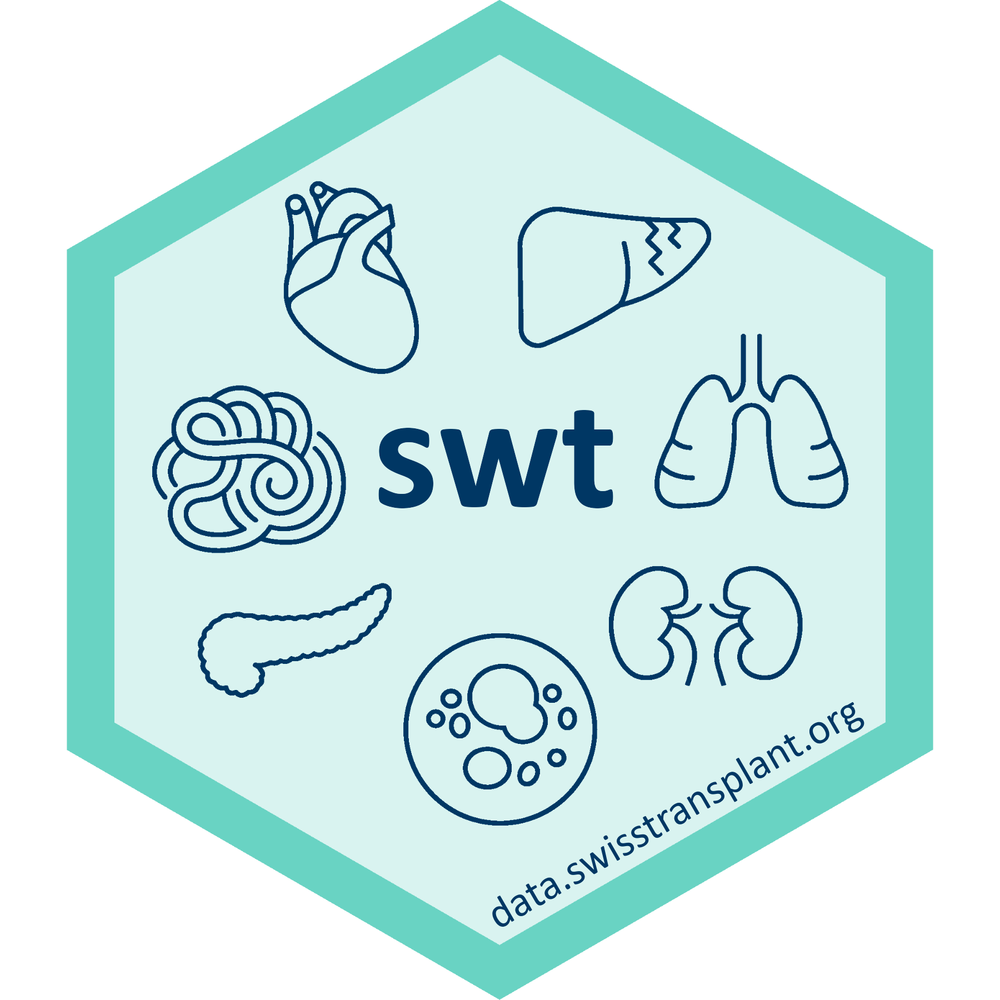

Below is a list of research software available for download that enables state-of-the-art data analysis at Swisstransplant.

## Basic statistics software

The basic statistics software enables statistical reporting for research projects and national statistics about organ donation and transplantation. They also allow the development of statistical tools at Swisstransplant, such as data pipelines or Shiny applications.

The core statistical software supports statistical reporting for research projects and national organ donation and transplantation statistics. It also enables the development of analytical tools at Swisstransplant, including dashboards applications.

-   The R Project for Statistical Computing <https://stat.ethz.ch/CRAN/>
-   RStudio Desktop <https://posit.co/download/rstudio-desktop/>
-   Quarto <https://quarto.org/docs/download/>

::: {.callout-tip appearance="simple"}
The RStudio desktop installer for Windows 10 requires administrator rights. However, it is possible to download a zip bundle from the download page, unpack the files into a folder, for example, `software`, and create a shortcut with `rstudio.exe` on the desktop or the taskbar.
:::

### Additional software

Software for additonal tasks is listed below, for example, for updating this web portal on GitHub, or for R package building.

-   Git version control system <https://git-scm.com/downloads>
-   RTools <https://cran.r-project.org/bin/windows/Rtools/>

## Swisstransplant R package

{height="2in" style="float:right; padding:0px"}

The Swisstransplant R package `swt` is the Swiss army knife for data analysis at Swisstransplant. It is under constant development. It can be installed in R as follows:

``` r
remotes::install_github("Swisstransplant/swt")
```

Statistical reporting:

-   A Swisstransplant Quarto project template for documents and presentations
-   The Swisstransplant color scheme `swt_colors()` and a ggplot2 style `swt_style()`
-   Tidy helper functions for descriptive statistics, missing data, regression models, and format *p*-values

Research:

-   HLA mismatch calculator designed for the antigens format as found in SOAS
-   Calculators for KIDMO, eGFR, US and UK KDRI
-   Tools to read and process data from the LifePort kidney transporter

The [source code is developed on GitHub](https://github.com/Swisstransplant/swt), and a [package manual](https://github.com/Swisstransplant/swt/blob/main/manual/swt.pdf) is available.

## R Cookbook

The [R Cookbook](https://swisstransplant.github.io/rcookbook/) shows how to use the Swisstransplant R package `swt` to make high-quality reports and publication-ready graphics in our in-house style.
